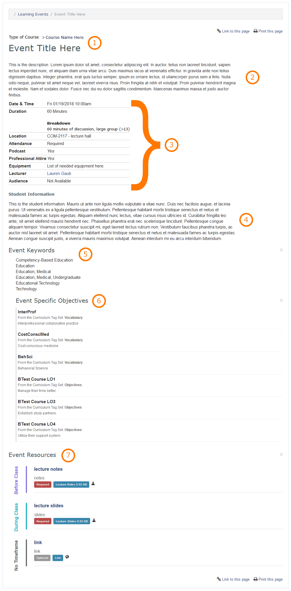

#MedLearn - Learning Events

When you click on Learning Events in the main menu, you will see a list of events in which you are part of the audience of. On the main screen with the list of events you can apply filters to refine the list of events that displays, additionally you can change your view to be daily, weekly, monthly, or yearly. 

You can click on an event to view event details; who the lecturer is; where the event takes place; whether or not the event is podcasted, requires professional dress, or has required attendance; event objectives, and more. 

## Course and Event Information

At the top of the event overview page you will see what course the event belongs to in addition to the event title. 

## Event Description

Optionally, the event's teaching faculty, course director and/or coordinator can add an event description to give students an overview of the topic. 

## Event Details

The event details table provides you with a lot of important information such as:

* Date and Time of Event
* Duration and Event Type (e.g. Lecture, Team-Based Learning, etc.)
* Location
* Whether or not attendance is required
* If the event is podcasted or not
* If professional attire is necessary
* If you need to bring any specific equipment to the event (e.g. iPad, pen/pencil, etc.)
* Who the lecturer of the event is
* Who the audience of the event is (if provided)

## Student Information

If the teaching faculty, course director or coordinator has a message to relay to the students about the event, information will be entered in this section. For example they might make note of a guest presenter or if standardized patients will be present. 

## Event Keywords

Event Keywords include MeSH (Medical Subject Headings) terms that Curricular Affairs has associated with the event for reporting purposes. 

## Event Specific Objectives

Event Specific Objectives are the objectives that will be covered during the session. The objectives should match those in the notes provided by the teaching faculty, but there could also be additional objectives attached from other tag sets such as Vocabulary. Vocabulary terms identify threads and disciplines that are covered during this event. 

## Event Resources

The course coordinator will post all notes, slides, readings, and any other event specific resources to this section. Some resources have a timeframe associated with them (e.g. before class, during class, after class). Also, a resource can be marked as required or optional. 