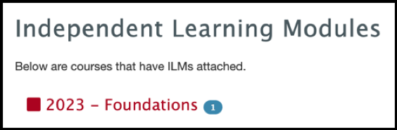
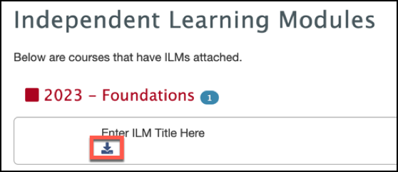
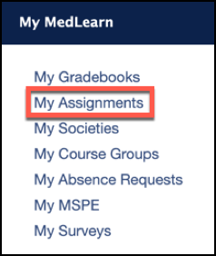
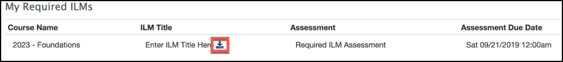

# MedLearn - ILMs

The Independent Learning Modules (ILMs) tab will display for all students logging into MedLearn.

## What are ILMs

Independent Learning Modules are course supplements to assist students with further practice or assistance with class learning objectives. Although some ILMs can be required and graded, many will be recommended materials designed to suppliment student courses.  

## The ILMs Tab

The ILMs tab will allow students to view all ILMs that they ever has for any class they were enrolled in since the beginning UA's College of Medicine - Tucson.  

To view all ILMs:

* Log into MedLearn
* Click the ILMs tab

* A list of all classes with ILMs attached will be displayed that the student has been enrolled in

* Click the course to expand all ILMs for the course
* Click the ILM to view it

## Required ILMs

In some instances ILMs will be required as part of a student's course. If an ILM is required the student will see the ILM in their My Assignments page in MedLearn. 

To access required ILMs:

* Click My Assignments

* Scroll to the bottom of the page
* Click on the ILM in the My Required ILM Section to launch the ILM

