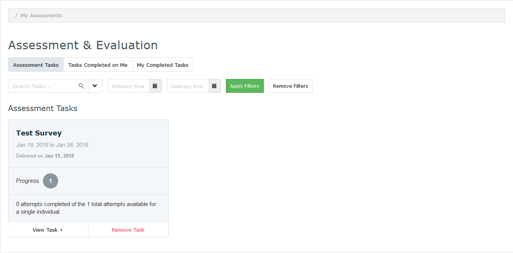

#MedLearn - Assessment & Evaluation (aka Surveys)

https://arizona.box.com/s/ud3cjji3tku459kdccsg14mzb2128jlk

When you click on Assessment & Evaluation at the top right corner of the screen, you will be able to complete assessment tasks, view tasks completed on yourself, and view your previously completed tasks.
* Refer to the top, right portion of the screen
* Click the Assessment & Evaluation link to be directed to student assessments
* Click the corresponding tab to view
    * **Assessment Tasks** – Course/instructor evaluations you must complete
    * **Tasks Completed on Me** – Results of assessments completed about you
    * **My completed Tasks** – Assessment tasks you have completed

## Complete Assessment Tasks

* Click **Assessment Tasks**
* Assessments to complete are displayed
* Click **View Task**
* Complete the fillable form
* Press **Save as a Draft** to complete later or **Submit**

## View Assessments Completed on you

Depending on the type of assessment, you might be able to view the results of a survey completed on you. Some results show the entire form, while others only show you the free text comments written about you
* Click **Tasks Completed on Me**
* To download a PDF version
    * Click the **Download PDF** box or
    * Press **Select All** followed by **Download PDF**

## View Your Completed Tasks

To review past surveys you filled out:

* Click on **My Completed Tasks**
* Click **View Task** to review an individual survey
* Click the **Download PDF** or **Select All** followed by **Download PDF** to download and review multiple surveys

Completed tasks are not editable.
