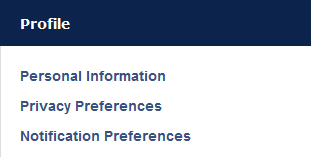

#MedLearn - Your Profile

When you click on your name at the top right corner of the screen, you will be able to view your user profile and modify some preferences. 

Optionally you can add additional personal information such as a secondary email address, a telephone number, a fax number, and an address. You can also update your privacy preferences and notification preferences. 