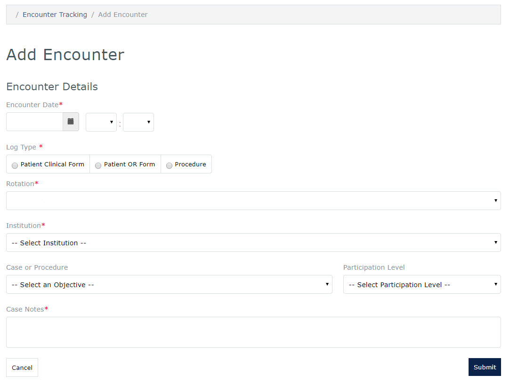

# MedLearn - Logbook
## Add Logbook Encounters

* Click the **Clerkship** tab followed by **Logbook** 
* The **Encounter Tracking Entries** screen is displayed
* Click the **Log Entry** button, log types include:
    * Patient
        * Clinical Form
        * OR Form
    * Procedure
* Select the **Encounter Date** and time
* Select the **Log Type**
* Select the **Rotation**
* Select the **Institution**
* Select a **Case or Procedure**
* Select a **Participation Level** _(Patient Cases Only)_
* Add **Case Notes** _(Patient Cases Only)_
* Press the **Submit** button

## Edit Logbook Encounter
_**NOTE:**  Changes are allowed only to encounters in the currently enrolled rotation._

* Return to the Encounter Tracking Entries screen
* Click on the entry you wish to edit
  * The Search field can be used to filter the list of encounters
* Update applicable information
* Press the Submit button
