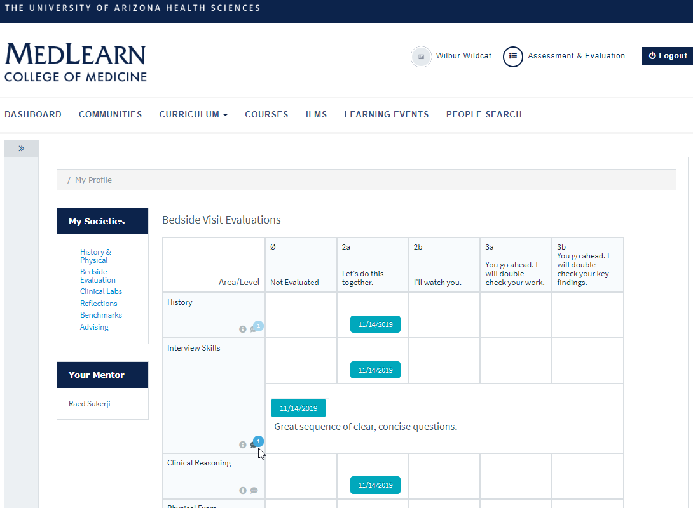

# MedLearn - Societies

##Bedside Visit Evaluations
Under the “My Societies” view, you can view your bedside visit evaluation, as well as any comments your society mentor had for all bedside evaluations completed during the active academic year, as well as view the related competencies assessed on this rubric.
 
Viewing Comments for Bedside Visit Evaluations

* Go to “Bedside Evaluation” on the left hand navigation menu.
* From here, select the date you would like to view along the top circles
* The matrix will update to display that date’s evaluation
*Click the speech bubble in the bottom right corner of the Area/Level Column 

##History & Physical
Uploading a History & Physical Write-up 

* Select the “History & Physical” option in the “My Societies” Navigation menu on the left hand bar
* Here you can see all assigned H&P Write-ups, any documents uploaded by your mentor for each, and the 	visit and due date 
* To upload, select the plus sign under the “Upload Write-up” column

**Note:** You can only delete an uploaded file if within 24 hours of your original upload

##Clinical Labs
* Clinical labs for the entire academic year are entered into MedLearn at the beginning of the academic year and are available to view under the “Clinical Labs” link in the Societies navigation bar.
* For each lab, your mentor will note whether you were prepared for the lab and can add additional comments for you.   

##Reflections
* In the reflections screen you will see all of the assigned reflections assignments and the due date for each as well as any files that your mentor has uploaded for that date.
* To upload, click the plus sign and select a file on your computer

**Note:** After 24 hours, you will not be able to delete an uploaded file.

##Benchmark
<video width="80%" controls="controls">
<source src="https://arizona.box.com/shared/static/01vyxyr18tt4oaxle56drutxuuyff0qt.mp4" type="video/mp4">
</video>

On the benchmark screen, students are able to self-assess on their growth and performance in Doctor and Patient across semesters, as well as see their mentors' feedback. 
