<html>
<h1>Cerner Login for Medical Students - Includes Banner Self-Enrollment with Azure MFA</h1>
<body>
    <h2>1. Questions/Assistance with Cerner Login</h2>
    
Please view the video below to understand how to log into Cerner as a Medical Student with the College of Medicine - Tucson

    <video width="80%" controls="controls">
    <source
    src="https://arizona.box.com/shared/static/81z3pvhwdpnfqug8wrfbegqzw83b0nq0.mp4"
    type="video/mp4">
    </video>
    <h2>Self-Enrollment with Azure MFA</h2>
    
These instructions will guide you through the Microsoft Authenticator app on your personal device and enrolling in Azure MFA for multi-factor authentication. You can add multiple methods with self-enrollment, but whatever method you choose first will be the default option for confirming your identity:

    <ol>
    <li><b>Go to </b><a href="https://mysignins.microsoft.com/security-info" target="_blank">Https://mysignins.microsoft.com/security-info</a></li>
        <li>Select <b>+ Add Method</b></li>
        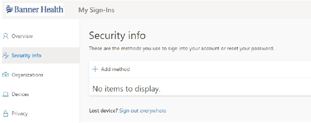
        <li>Select <b>Authenticator App</b> from the drop down menu</li>
        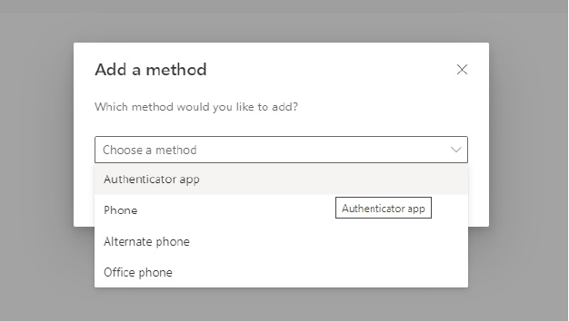
        <li>On your personal device, download the Microsoft Authenticator app from the app store</li>
                *For Android Devices - <a href="https://play.google.com/store/apps/details?id=com.azure.authenticator" target="_blank">https://play.google.com/store/apps/details?id=com.azure.authenticator</a> 
                *For iOS Devices - <a href="https://apps.apple.com/us/app/microsoft-authenticator/id983156458" target="_blank">https://apps.apple.com/us/app/microsoft-authenticator/id983156458</a>
        <li>After downloading the app, pres <b>Next</b> on your computer screen</li>
        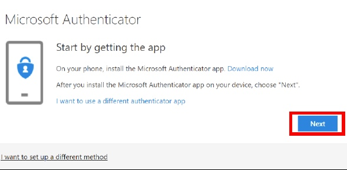
        <li>On your personal device, follow the prompts on the screen to add an account in the Microsoft Authenticator App</li>
            <ul>
                <li>Press <b>Add New Account</b></li>
                <li>Select <b>Work or School Account</b></li>
                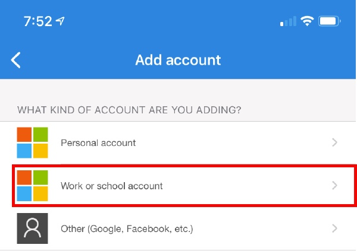
                <li>Select <b>Scan QR Code</b></li>
                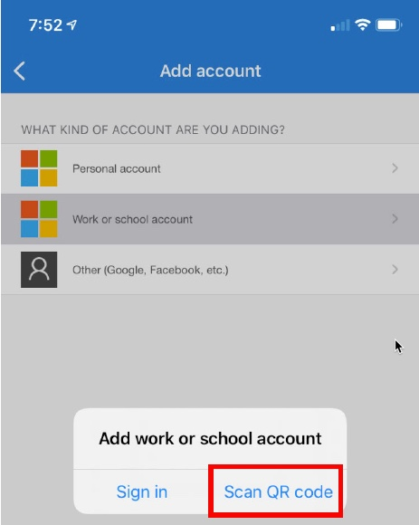 
            </ul>
        <li>On your computer screen you will see the QR code unique to your registration</li>
        <li>Using your device's camera, place the QR image in the view finder to allow the app to scan the code</li>
        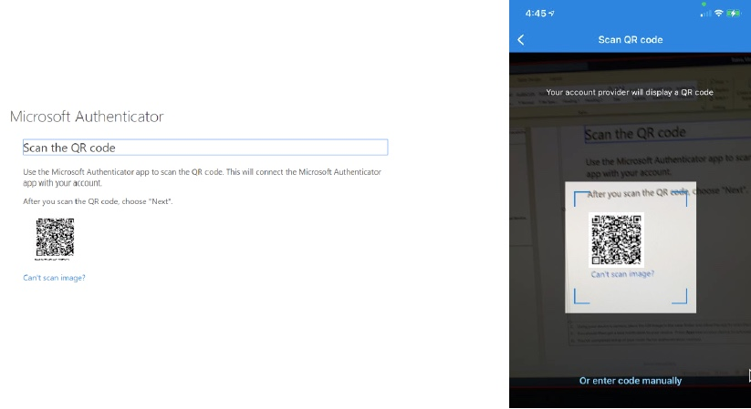
        <li>Click <b>Next</b> on your computer after you scan the QR code</li>
        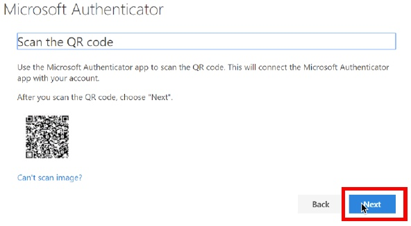
        <li>A test notification will be sent to your personal device. Press <b>Approve</b> on your device to acknowledge the authentication test request</li>
        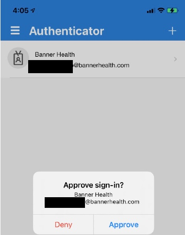
        <li>Click <b>Next</b> on your computer screen to complete the registration process</li>
    </ol>
    
If you have the Microsoft Authenticator app downloaded on your personal device and have a registered Banner account:

    <ol>
        <li>Go to <a href="https://mysignins.microsoft.com/security-info" target="_blank">https://mysignins.microsoft.com/security-info</a></li>
        <li> Select <b>+ Add method</b></li>
        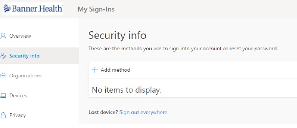
        <li>Select <b>Authenticator app</b> from the drop down menu</li>
        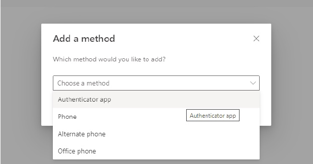
        <li>Press <b>Next</b> on your computer screen</li>
        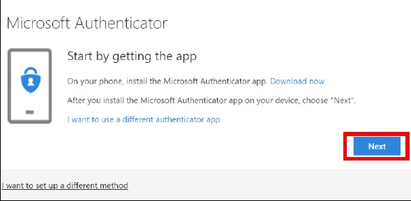
        <li>Open the Microsoft Authenticator app</li>
        <li>Select your registered Banner account</li>
        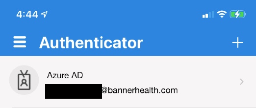
        <li>Select <b>Set up 2-step verification</b></li>
        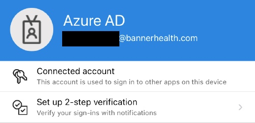
        <li>On your computer screen you will see the QR code unique to your registration</li>
        <li>Using your device's camera, place the QR image in the view finder to allow the app to scan the code</li>
        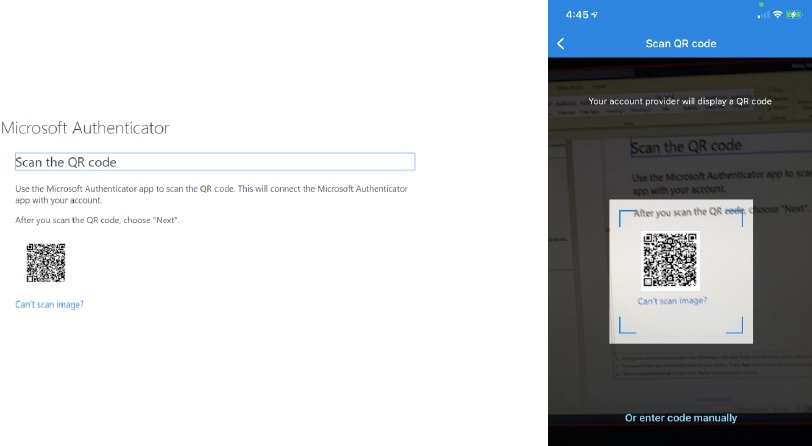
        <li>Click <b>Next</b> on your computer after you scan the QR code</li>
        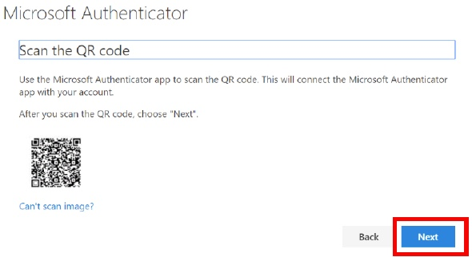
        <li>A test notification will be sent to your personal device. Press <b>Approve</b> on your device to acknowledge the authentication test request</li>
        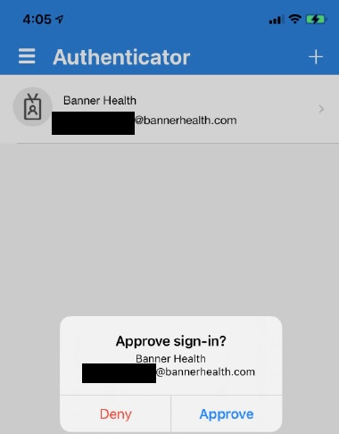
        <li>Click <b>Next</b> on your computer screen to complete the registration process</li>
    </ol>
    
<b>Please be aware that this process is internal to Banner. The College of Medicine - Tucson IT Department does not have access to Banner's Azure MFA environment and as such cannot provide support for this process. If you need assistance please contact Banner IT at (520)694-4357.</b>

    