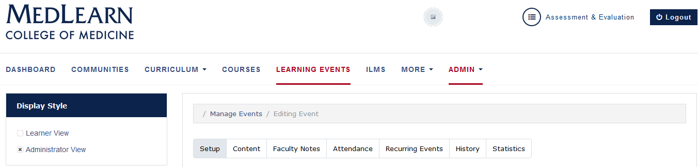

### New Learning Events
* Return to the main screen

* Click the **Learning Events** tab
* Select **Administrator View** from the left menu
* Click **Add New Event**
* Select the course from the **Select Course** dropdown
* Assign an **Event Title**
* Select an **Event Type**
* Add all pertinent information requested on the screen
* Refer to the **After Saving** field to select the next function
*  Press the **Save** button to be directed to the next function
