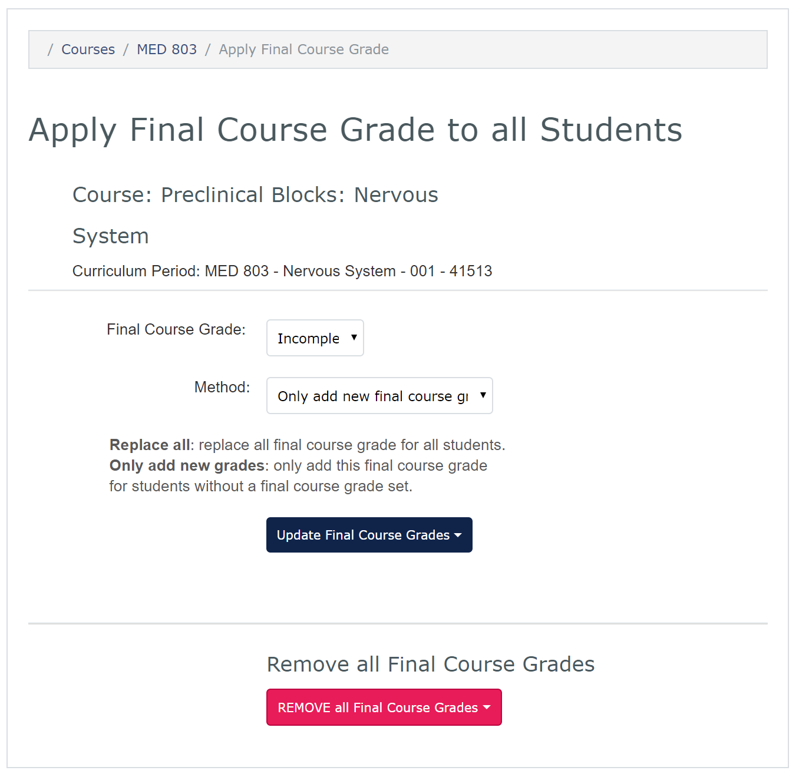

## Record Final Course Grades and Retake Scores
The **Grade Spreadsheet** is also used to add final course grades, retake scores, reassessment scores, and remediation scores. You can individually add these grades, or you can use the Apply Final Grade dialog to apply on final course grade to all students. You can also remove all final course grades from the gradebook.

To individually record final course grades and retake scores:
* Refer to the main **Gradebook** screen
* From the **Grade Spreadsheet** pulldown menu, select **View/Edit** to bring up the Gradebook Spreadsheet
* Students are listed in the left column with competency grades in the columns to the right
* To record the Final Course Grade:
	* Click in the **Final Course Grade** cell or the desired student
	* From the resulting pulldown menu, select the appropriate grade
	* Click the **OK** button to save the grade
* To record MK Retake, Behavioural Reassessment or Remediation grades and scores:
  * Click in the desired field for the desired students
	* For grades, select the appropriate grade from the pulldown menu
	* For scores, enter the appropriate score
* Use the **Close** button to close the Gradebook Spreadsheet

To apply a final course grade to all students:
* Refer to the main **Gradebook** screen
* From the **Grade Spreadsheet** pulldown menu, select **Apply Final Grade**
* Select the desired final course grade from the pulldown menu
* Select the desired method:
 * **Only add new final course grades** will not overwrite existing final course grades
 * **Replace all final course grades** will overwrite all existing final course grades
* Click **Update Final Course Grades**
* Confirm the desired action by clicking the **Are You Sure?** button
 * If you do not wish to confirm the action, click anywhere else on the screen

To remove all final course grades:
* Select the **REMOVE all Final Course Grades** button
* Confirm the desired action by clicking the **Are You Sure?** button
 * If you do not wish to confirm the action, click anywhere else on the screen

