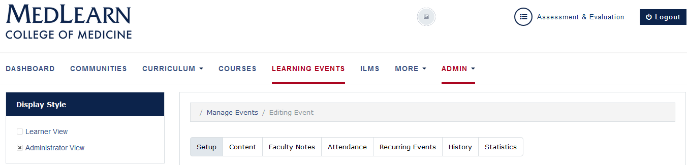

## Take Attendance
* Return to the main screen
* Click the **Learning Events** tab
* Search for a specific learning event

The default method of taking attendance is to manually indicate students who are in attendance

* Click the **Attendance** tab
* Indicate all students who attended the session (checkbox next to each name)
* They will automatically be saved to the database
* Press the **Download CSV** button to obtain a copy of the attendance
* If a student is absent without an excused absence request already entered, you will still need to submit an absence report for unexcused students
