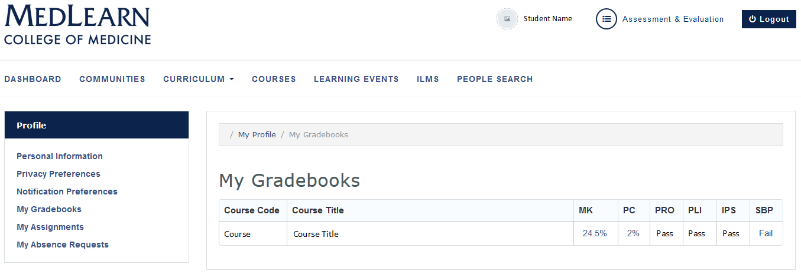

# Grades
* Refer to the top, right portion of the screen
* Click your name to be directed to your profile
* Click the **My Gradebooks** link in the left menu

* A list of courses and corresponding grades is displayed
* Click the **MK** and/or **PC** links to see a breakdown of the Medical Knowledge and Patient Care
  * Each assessment will be listed with the individual assessments, their “weight”, your score, and contribution toward final grade
  * Grade adjustments (if applicable) are displayed
  * Final course grade is displayed
