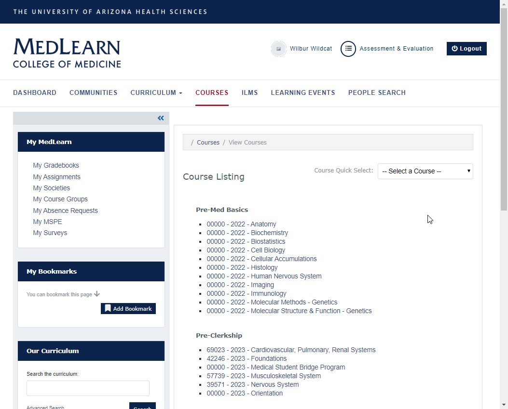

#MedLearn - Courses

When you click on Courses in the main menu, you will see a list of courses you are enrolled in. You can click on a course to view course details, contacts, objectives, and more. 

## Course Details

The Course Details section include contact information for your Course Director, Coordinator, and Faculty (if provided). Additionally you will be provided with the course description. 

## Course Objectives

Under the Course Details section is the Course Objectives section. The course objectives align with the Educational Program Objectives and Competencies established by the University of Arizona College of Medicine-Tucson. 

## Course Resources

Your Course Director and Coordinator will provide you will various resources relating to the course as a whole. Examples might include links to ILMs, a combined PDF of the class notes, pharmacology lists, and more. 