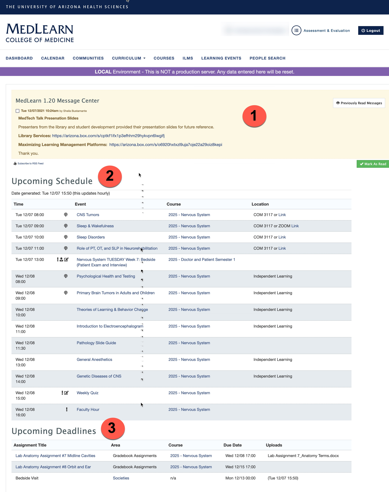

# MedLearn - Dashboard

  <video width="80%" controls="controls">
<source src="https://arizona.box.com/shared/static/0qa3bnh3k5rq4ufbnsw9g4712v3m67xh.mov" type="video/mp4">
</video>

The dashboard is displayed by default when logging in to MedLearn. If you navigate away from the dashboard, simply click on the MedLearn logo or the dashboard link to return to it.

##1. Message Center

The Message Center displays all messages for students. To acknowledge these messages check the box next to the message and click Mark as Read. This will clear the message center. If you would like to look at previous messages click the Previously Read Messages to navigate to the messages area in MedLearn.

##2. Upcoming Events

Upcoming Events list all events for the current day as well as the next business day. This list is updated hourly. Clicking the event name will navigate students to the specific event with all details as well as links to download event resources. Clicking on the course link will navigate students to the course page with all information and links to course resources. If the event is podcasted the link to Zoom will be listed in the location column. Click the link to be placed into the course. 

##3. Upcoming Assignments

The upcoming assignments section will list all assignments due up to the past due date. Clicking on the assignment will navigate the student to the assignment upload page in MedLearn. If there is a document already uploaded the document title will display under the Uploads column. If no document is uploaded the column will be blank. For societies assignments click the Societies link in the Area column to be navigated to My Societies to complete your assignment.