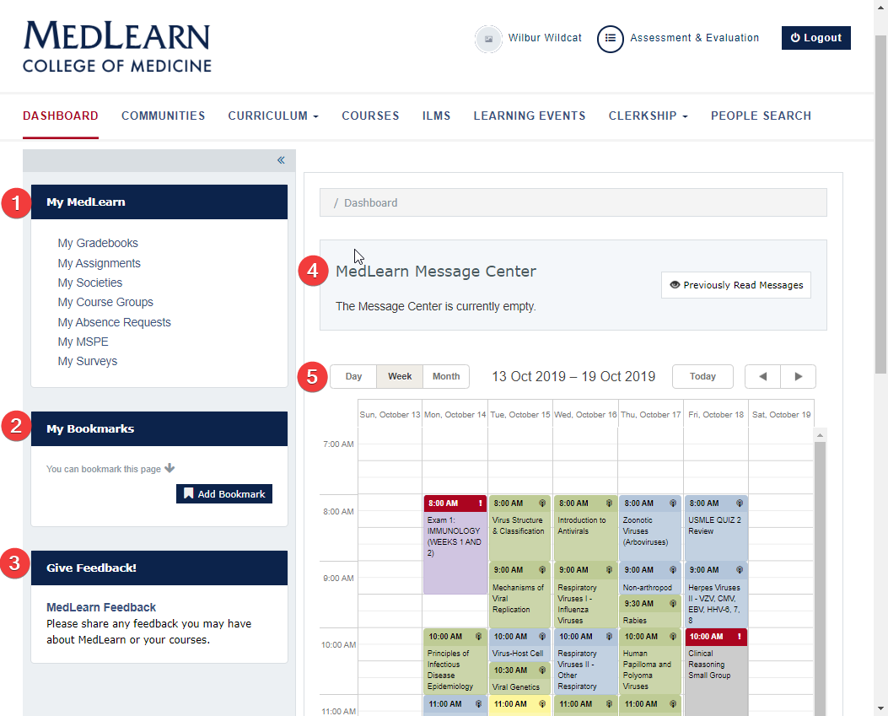

# MedLearn - Dashboard

  <video width="80%" controls="controls">
<source src="https://arizona.box.com/shared/static/mmng5mos6kokxureeyf9yfuwm8f5xxbi.mp4" type="video/mp4">
</video>

The dashboard is displayed by default when logging in to MedLearn. If you navigate away from the dashboard, simply click on the MedLearn logo or the dashboard link to return to it.

##1. My MedLearn

My MedLearn provides students with quick access to commonly used areas of MedLearn. The links within My MedLearn are the same for all students.

##2. My Bookmarks

My Bookmarks allows users to create custom quick links specific to their user account. If you frequently are going to the same page, you can add it as a bookmark, or if you want to remember to return to a certain page in MedLearn you could add it as a bookmark as a reminder, then delete it once you are finished. Your bookmarks are unique to your account, so no one else can see what you have bookmarked in MedLearn.

##3. Give Feedback

Students are able to submit feedback for specific courses or for IT. IT feedback might include a suggestion or a bug/issue you've identified. Course feedback is specific to the course you select in the feedback form, and is anonymously reported to the Course Director, Coordinator, and Student Advisory Committee.

##4. MedLearn Message Center

Faculty and staff are able to post messages containing student information. Once posted, messages are shown on the dashboard within the MedLearn Message Center. Unread messages display by default when you view the dashboard. You can also mark messages as read so that they no longer appear. If you want to review previously read messages click on Previously Read Messages.

##5. Calendar

Learning events for each of the courses are displayed on the student calendar. Event details (e.g. location, duration, attendance requirements, etc.) and resources are accessed by clicking on the event.

* The calendar defaults to the current week
* Refer to the date range field
* Use the arrows to select past and future dates
* Click on the event to review event details
* Pay special attention to the texts in the Attendance, Podcast, and Professional Attire fields
* Click on the Event Resources link to access learning materials

Additionally, you can subscribe to your MedLearn calendar. Subscribe by URL, rather than download, to receive updates as schedules are updated.