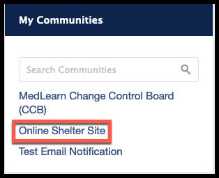

# MedLearn Communities - GME The Shelter User Guide

## Purpose

The Shelter is a project that has been proposed by many Mental Health Professionals with many decades of experience in helping medical residents to cope with the stress of current issues within the medical field as it relates to COVID-19. The purpose of the Shelter is to allow residents and fellows to connect with fellow colleagues with the intent of finding social support, validation, an ear to be heard, and a place where they can learn about techniques for coping and healing.

The platform that this forum will live in is the communities’ section within MedLearn. MedLearn is the University of Arizona’s College of Medicine –Tucson online learning management platform that is used by medical students and others within the college. 

This user guide will assist users with logging into the Shelter community within MedLearn, view anouncements, and post/reply and view discussions.

## Using the Shelter community

### Log in via direct link to the Shelter

The Shelter will be housed in an area of MedLearn called communities. One of the ways to log into the Shelter would be via the direct link. To log into the Shelter via the direct link:

1. **Navigate** to <a href="https://medlearn.medicine.arizona.edu/community/onlinesheltersite">Online Shelter Site</a>
2. **Click** login via UA NetId WebAuth
3. You will see the homepage for the Shelter Community

### Log into the Shelter via MedLearn

The second way to log into the Shelter is via MedLearn. To Log into the Shelter via MedLearn:

1. **Navigate** to MedLearn by clicking <a href="https://medlearn.medicine.arizona.edu">here</a>
2. **Click** login via UA NetID Webauth
3. **Login** with your NetID and Password
4. **Click** the Communities tab 

5. **Click <a href="https://medlearn.medicine.arizona.edu/community/onlinesheltersite">here</a>** in the My Communities menu 

6. You will see the homepage for the Shelter Community

### Viewing Announcements

Members will be able to view announcements posted to the community by administrators of the community. To read these announcements:

1. On the community homepage
2. **Click** the Announcements tab at the top of the page 

3. The announcements will be listed on this page you can click on the individual announcement to view the announcement fully

### Posting announcements

If the community administrators want to allow members to post announcements they will be provided with an announcements page specifically for member posted announcements. It is up to the administrator but announcements will need to be approved before approved. To post an announcement:

1. From the main homepage
2. **Click** the Announcements tab
3. **Click** add Announcement 

4. **Enter** an announcement title in the Announcement Title field
5. **Type** the announcement in the Announcement Body field
6. **Check** whether or not to notify announcements
7. **Set** the time release options
8. **Click** save 

9. The form will be submitted for approval. Once it is approved the announcement will be posted

### Reading Discussion Threads

Members will be able to take part in discussions within the Shelter community. To read discussion threads:

1. From the Online Shelter homepage
2. **Click** the Discussions Tabs
3. In the discussions area click on the discussion thread you wish to read

4. **Click** the post you wish to read 

5. You can read the posts 

### Posting New Discussion Threads

As a community member you will be allowed to post new threads to discussions. To add new posts to a discussion:

1. From the discussion you wish to create a new post
2. **Click** New Post 

3. **Enter** your post title in the Post Title field
4. **Enter** the post body in the Post Body field
5. **Check** the “Hide my name from Community Members” field – This is very important to conserve Annonmity.
6. **Decide** if you want to receive e-mail notifications when people reply
7. **Attach** files if you want
8. **Enter** time release options
9. **Click** Save 

10. Your post will be saved 

### Replying to Discussions

As a community member you will be allowed to reply to discussion posts. To reply to a post:

1. **Click** reply to post

2. **Enter** your post in the Post Body
3. **Check** “Hide my name from other community members” so you can conserve anonymity
4. **Decide** if you want to receive e-mails when people reply to this thread
5. **Attach** files if you want
6. **Determine** time options
7. **Click** Reply 

8. The reply is posted 
