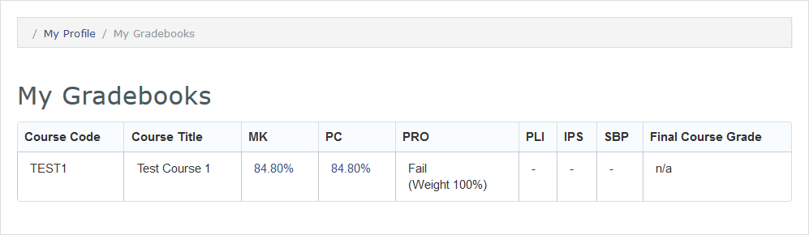
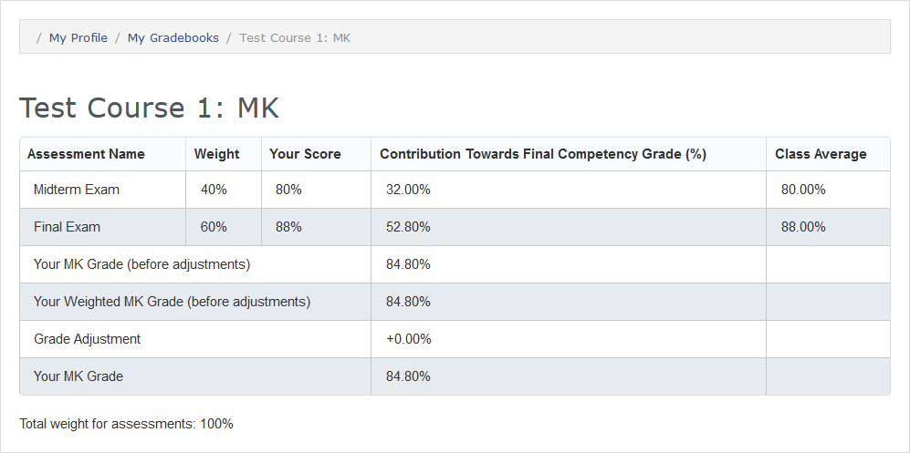

#MedLearn - Grades

Under My MedLearn you will have a link to My Gradebooks. Once you click on that link you will see a table of all your enrolled courses and your corresponding grades by competency and your final course grade. 

To view a grade breakdown by assessment for MK and PC click on the percent shown on the main screen. This will take you to a detailed overview of your grade for those competencies. 

You will be unable to view a grade breakdown for behavioral competencies such as PRO, PLI, and IPS. Instead, you will see a pass or fail and the total weight of that competency accounted for thus far. 