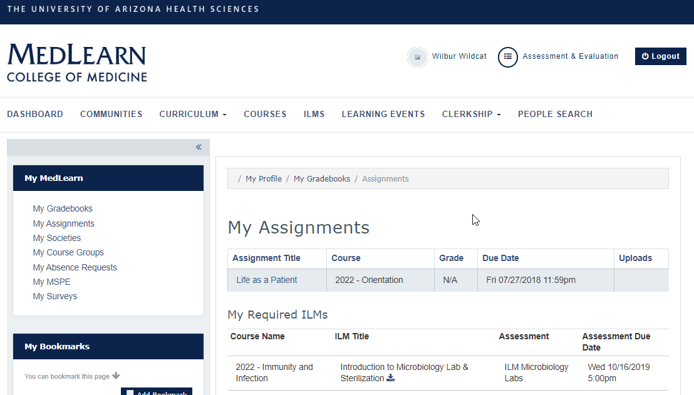
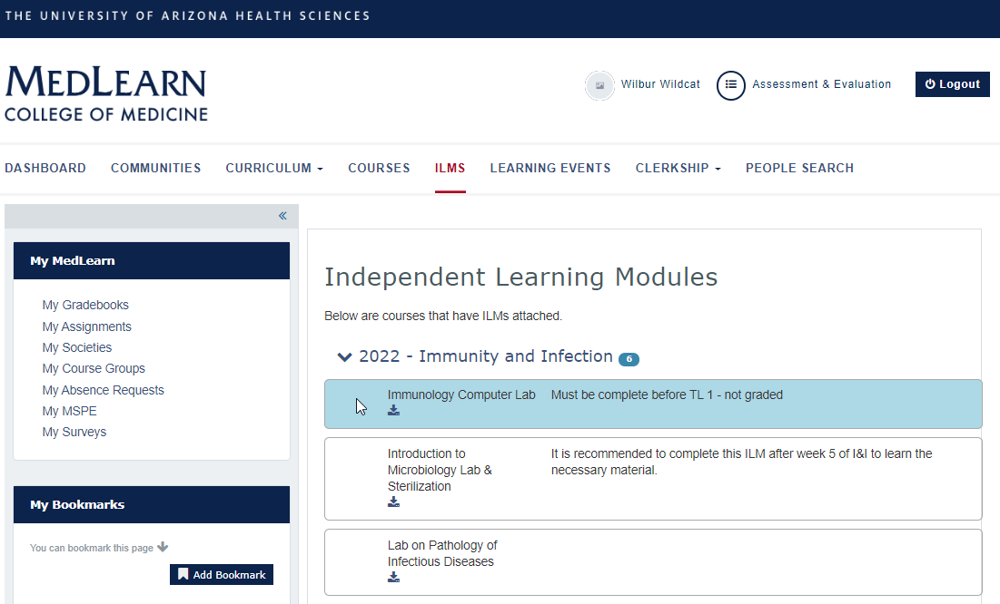

## What are ILMs?

Independent Learning Modules are created to provide students with further practice on class learning objectives. Although some ILMs may be required and graded,
 many will be recommended materials designed to supplement student learning.  

## View required ILM's

In some instances ILMs will be required as part of a student's course. If an ILM is required the student will see the ILM in their My Assignments page in MedLearn. 

* Click My Assignments from the sidebar
* Scroll to the bottom of the page
* Required ILMs are listed under the "My Required ILMs" heading

 

## View all available ILM's

* Click the ILM's tab from the navigation bar
* Click a course from the ILM list to see affiliated offerings

