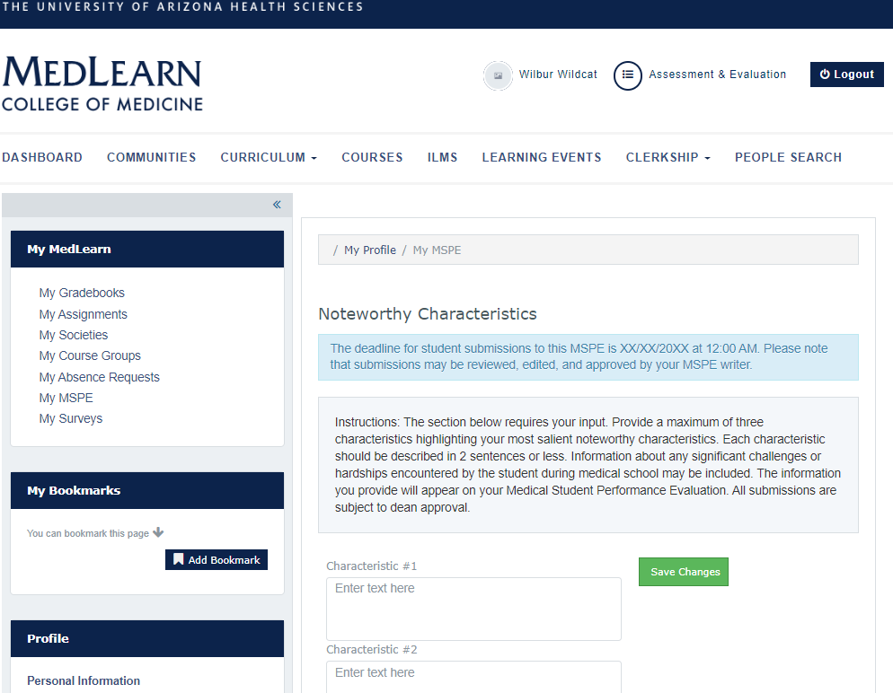

#Noteworthy Characteristics

  

When the period to enter your characteristics is open you will be able to enter three characteristics to include in your MSPE. The characteristics entered will be reviewed with your dean.

###Entering Noteworthy Characteristics

<video width="80%" controls="controls">
<source src="https://arizona.box.com/shared/static/opk8bcmb73ucpo9axayzux488xhjpn13.mp4" type="video/mp4">
</video>
 

* Click on **My MSPE** from the **My MedLearn** sidebar
* 3 text boxes are displayed 
* Enter noteworthy characteristics and click the **Save Changes** button  

**Note: ** You are able to edit your enetered noteworthy characteristics up until the due date listed at the top of the page
