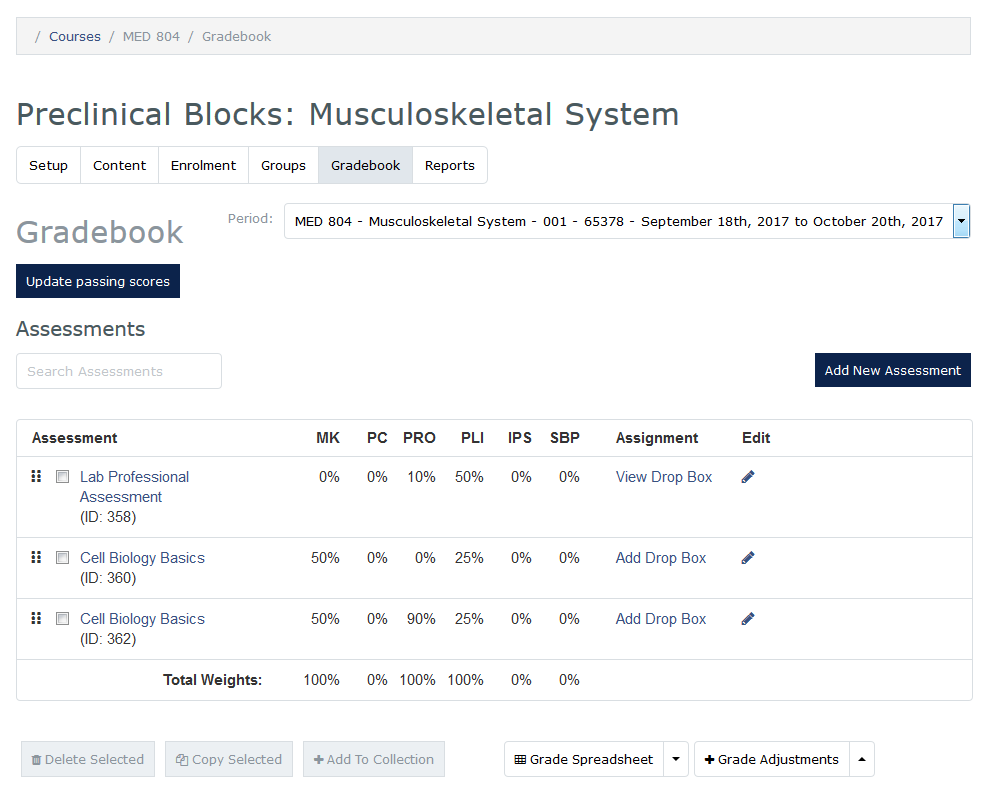

### Gradebook
* Click the **Courses** tab
* Click on the applicable course
* Select **Administrator View** from the left menu
* Click the **Gradebook** tab

### Update Passing Score
* Enter the passing score for each competency assessed in the course necessary to pass. For most courses this will be 70%.

### Add/Edit New Assessment
* To add a new assessment click **Add New Assessment**
* Go through each step of the setup process indicating the competency weights of the assessment, due date, assessment type/characteristics, etc.
* Click **Save** when you have finished creating the new assessment.
* When **editing** an existing assessment, you can edit the same fields as when you create an assessment from scratch.
* Click **Save** after making any changes.

### Manually Enter Assessment Scores
* Refer to the main **Gradebook** screen
* Click the name of the assessment that is being graded
* Scroll to the **Grades** section
* A table containing students enrolled in the course, NetID and competencies is displayed
* Competencies attached to the assessment are indicated with a “-“in the corresponding column
  * Click the “-“to enter the score
  * Enter a whole number
  * Enter or tab to the next field
  * The student’s score will be displayed as x/100

### Import Assessment Scores
Grades can be imported from ExamSoft, NBME or from a “Generic” form.  This function can also be used where grades have already been uploaded/entered and should be replaced with higher grades.

**Please NOTE:**  Grades from ExamSoft will not be posted by FTP as in the past. You will have to download them from ExamSoft and import them into MedLearn.
* Refer to the main **Gradebook** screen
* Click the name of the assessment that is being graded
* Press the **Import Grades** button
* The **Import Grades from file** screen will be displayed
  * Press the **Choose a file** button
  * Indicate if you prefer to **Replace with higher grades** or **Replace all grades**
  * Press the **Import file**  button

### Enter Grade Adjustments
* Begin typing the student’s name in the search field to access the list of students
* Click the student’s name in the search results
* Press the **add adjustment** button
* A column for the student will be added to the grid
* Refer to the **Competency** column
* Select the applicable competency(s)
* Click the field in the **Percentage** column to enter the grade
* Add a **Reason** for the grade change
* Repeat for as many students as necessary
* Press the **Close** button to save grades and exit the screen
* If you would like to bulk import multiple grade adjustments you can do so via the **Import** button

### Grade Spreadsheet
* If you would like to view student progress across all competencies assessed in a course, click on the **Grade Spreadsheet** button. This gives you a breakdown of student grades by competency.
* If you would like to look at the assessment grade details within a specific competency for a student, click on the percent showing.
* You can also export the grade spreadsheet to a CSV and view in Excel

### Record Final Couse Grades and Retake Scores
The **Grade Spreadsheet** is also used to add final course grades, retake scores, reassessment scores, and remediation scores.
* Refer to the main **Gradebook** screen
* Press the **Grade Spreadsheet** button
* Students are listed in the left column with competency grades in the columns to the right
  * Click in the **Final Course Grade** cell to select the final grade
    * Press the **OK** button to save the grade
  * Click corresponding cells to enter MK Retake, Behavioral Reassessment and/or Remediation scores
