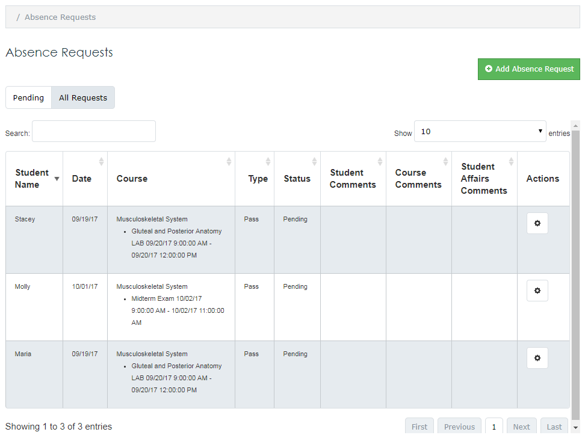

### Manage Absences
Students may be excused from mandatory classroom and clinical activities for cause (e.g. illness, conference presentations, leadership activities, personal passes, etc.).  Course directors and coordinators have the ability to excuse absences.  However, the Associate Dean of Student Affairs (and/or assigns) has the final say.
* Click the **Admin** tab > **Manage UA Absences**
* The **Absence Requests** screen will open
* A list of absences for the block will be displayed
  * The list of **Pending** absences is displayed by default
  * Click the **All Requests** tab to see a list of all absences
* Use the **Search** field to filter the results by:
  * Student Name
  * Date
  * Course
  * Type
  * Status
  * Comments

  

###	Enter Absences
* Press the **Add Absence Request** button
* The **Adding an Absence Request** screen will be displayed
* Type the **Student Name**
  * Corresponding student names will display as letters are being typed
* Enter a **Start Date** and an **End Date**
* A list of required sessions for the time period will be displayed
* Indicate the sessions for absence reporting by checking the box in the left column
* Select an **Absence Type**
* Assign an **Absence Status**= Excused or Unexcused absence
* Add **Director/Coordinator Comments**
* Press the **Save** button
* Absences are sent to Student Affairs for final decision (Excused or Unexcused)
* An email is sent to the student and coordinator after the final decision

###	Approve/Deny Requested Pass Days
A “daily digest” email will be sent when one or more absences, needing your attention, have been requested.
* Search for the request you wish to approve/deny
  * Searches can be done via the **Search** field or by clicking on column headers to sort results
* Press the corresponding cog wheel icon followed by **Edit**
* The **Editing an Absence Request** screen will be displayed
* A list of the applicable sessions is displayed
  * You have the option to edit the **Absence Type** if necessary
* Select an **Absence Status** = Excused or Unexcused absence
* Add **Director/Coordinator Comments**
* Press the **Save** button
* Absences are sent to Student Affairs for final decison (Excused or Unexcused)
* An email is sent to the student and coordinator after the final decsion

### Delete Requests
Students are prohibited from changing absence request information once submitted.  If submitted for an incorrect date, the request will need to be deleted and re-entered by the student.
* Search for the request you wish to delete
  * Searches can be done via the **Search** field or by clicking on column headers to sort results
* Press the corresponding cog wheel icon followed by **Delete**
* The **Delete Absence Request** screen will be displayed
* Confirm the absence request by pressing the **Delete** button
* The request will be removed from the **Pending** and **All Requests** tabs and will not be forwarded to Student Affairs
