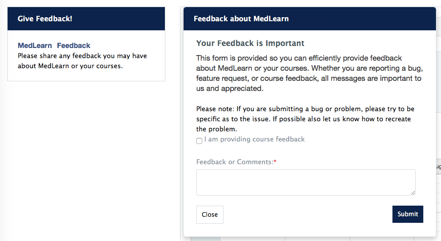

# Dashboard
Thank you for participating in the MedLearn pilot.  We have created an icon within MedPortal to help you access everything you need for the pilot.  Simply click on the icon “Fall 2017 Nervous System MedLearn Pilot”.  You will find icons to help you navigate to courses, events, assignments, gradebook, surveys, absence requests and important messages.  As well as a link to help you return to ArizonaMed.  The project team encourages you to submit course and system feedback through MedLearn.

**Please NOTE:** You will only have access to information specific to the pilot course in MedLearn.  Continue to use ArizonaMed for functions related to other courses.