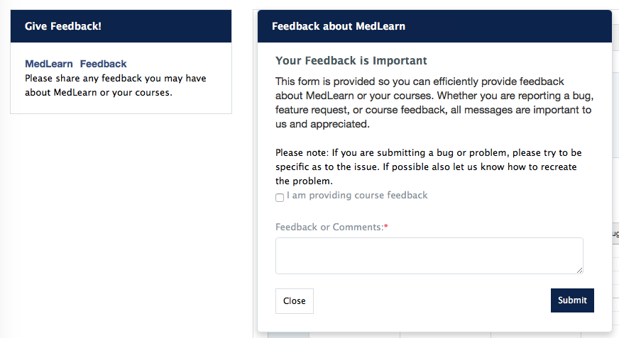
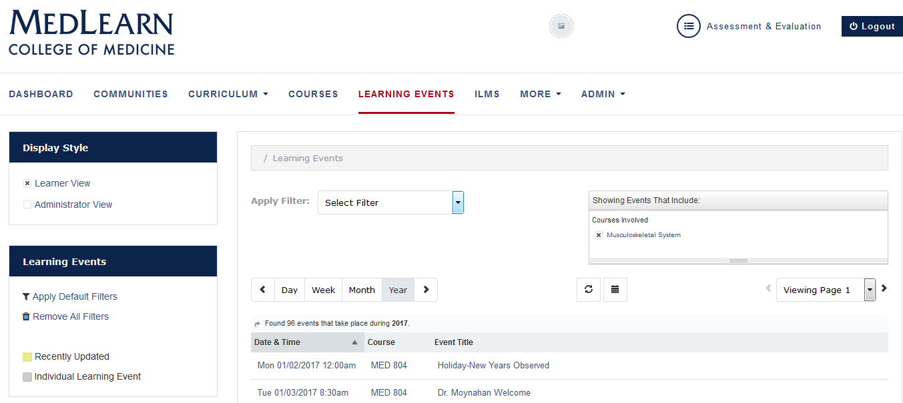

# MedLearn Coordinator Pilot Guide

### 1  Dashboard
Thank you for participating in the MedLearn pilot.  We have created an icon within MedPortal to help you access everything you need for the pilot.  Simply click on the icon “Fall 2017 Nervous System MedLearn Pilot”.  You will find icons to help you navigate to courses, events, assignments, gradebook, surveys, absence requests and important messages.  As well as a link to help you return to ArizonaMed.  The project team encourages you to submit course and system feedback through MedLearn.

**Please NOTE:** You will only have access to information specific to the pilot course in MedLearn.  Continue to use ArizonaMed for functions related to other courses.

### 2 Courses
MedLearn provides two views of course details:  The Learner View (default) and the Administrator View.  Both are selected from the Display Style box in the left menu.

#### 2.1 Edit Courses
Editing courses is used to add the course director, course coordinator, associated faculty, MeSH Keywords, course objectives, additional tags (e.g. Vocabulary), enrollment, course description, director’s message, and course resources:
* Click the **Courses** tab
* Click on the applicable course
* Select **Administrator View** from the left display style menu
* The **Setup** tab is open by default

##### _2.1.1 Course Setup_
* Enter **Course Contacts** information
* Attach **Course Keywords** (A.K.A. MeSH Terms)
* Attach **Course Objectives** and **Additional Tags** (A.K.A. Vocabulary)
  * Press the **Show Curriculum Tag Sets** button
  * A list of categories will be shown
  * Select the appropriate course objectives and/or vocabularies
  * It/they will be added to the course
  * Press the **Hide Curriculum Tag Sets** button to collapse the list
* Verify **Course Enrollment**
  * Enrolling students in a course is a multi-step process. **Make sure you click save before navigating away from the course you are editing.**
  * First, you need to create a **Course List** cohort (Admin / Manage Cohorts / Add New Cohort)
  * Once the course list is created, return to the course you are working on and select the appropriate **Enrollment Period** from the dropdown menu. The selected period will display in the **Active Periods** section.
  * In the active periods section click Add Audience, and attach the appropriate course list.

* Press the **Save** button. This will direct you to the **Content** tab.

##### _2.1.2 Course Content_
* In the content tab, you can add a course description, director’s message, verify course objectives, and attach course resources.

##### _2.1.3 View Enrollment_
* Click the **Enrollment** tab
* Ensure the correct **Period** is selected
* The list of students will be displayed in grid format by default
* The list can be changed to directory view by clicking
* The list of students can be downloaded to CSV or printed

##### _2.1.4 Course Groups_
* Navigate to the **Groups** tab.
* This is where you can create Team Learning groups, Societies groups, Clinical Reasoning groups, etc.

### 3  Events

#### 3.1 Select a Learning Event
* Click the **Learning Events** tab
* Select **Administrator View** from the left menu or
* **Select Filter**(s) to locate the events (“sessions”) corresponding to your course
* Define results by **Day**, **Week**, **Month** or **Year**
  *	Use the <> to advance the date
  * Use the calendar icon to select a specific date
* The list of events will be displayed
* Click on the event name to modify/view any of the event details (content, faculty notes, etc.)

#### 3.2 Learning Event Setup
* Click the **Setup** tab
* You can edit the event title, date and time, location, event type, and other fields
* It is important to setup the Associated Faculty correctly, as this impacts teaching effort/credit
  * Author = faculty/staff member that **creates** learning material
  * Editor = faculty/staff member that **updates** learning material
  * Faculty = facilitators or additional lab faculty helping/facilitating an event
  * Lecturer = faculty/staff member actually **teaching** in front of the class
* You can also indicate if an event is required attendance, podcasted, or professional dress, if any event equipment is necessary, and the audience of the event

#### 3.3 Adding Content
* Click the **Content** tab
* Set-up information is displayed
* Add an **Event Description**
* Add **Required Preparation** if applicable
* Attach **Keywords** (A.K.A. MeSH Terms)
  * Click the link to “release all keywords” on the learner view
* Enter **Event Objectives**
  * Click the link to “release all objectives” on the learner view
  * Press the **Map Additional Objectives** button to attach the applicable event objectives or additional tags (e.g. vocabulary)
* Press the **Add a Resource** button to add resources
  * The **Add Event Resource** wizard will open
    * Information required is based on the type of learning resource selected
    * Click the **Next Step** button to advance through the screens
    * An on-screen message will be displayed when the resource is complete
      * **Close** the screen or
      * Press the **Attach another Resource** button to continue

#### 3.4 Faulty Notes
* You can post notes that are only visible to faculty, within the Faculty Notes tab within the learning event

#### 3.5 Take Attendance
The default method of taking attendance is to manually indicate students who are in attendance

* Click the **Attendance** tab
* Indicate all students who attended the session (checkbox next to each name)
* They will automatically be saved to the database
* Press the **Download CSV** button to obtain a copy of the attendance
* If a student is absent without an excused absence request already entered, you will still need to submit an absence report for unexcused students

#### 3.6 Event History & Statistics
Changes to events including: a description of the change, who made the change, date and time are stored in the **History** tab.

* Select the **History** tab
* All changes will be listed

Event **Statistics** show who and how many times an event has been viewed.

#### 3.7 Delete Learning Events
* Click the **Learning Events** tab
* Select **Administrator View** from the left menu or
* **Select Filter**(s) to locate the events (“sessions”) corresponding to your course
* Define results by **Day**, **Week**, **Month** or **Year**
   * Use the <> to advance the date
   * Use the calendar icon to select a specific date
* The list of events will be displayed
* Place a check in the box next to the target event
* Press the **Delete Selected** button followed by the **Confirm Removal** button

#### 3.8 Creating New Learning Events
* Click the **Learning Events** tab
* Select **Administrator View** from the left menu or
* Click **Add New Event**
* Go through the steps outlined about for each tab of the event

### 4 Independent Learning Modules (ILMs)
* In MedLearn you will create ILMs the same way as learning events. You will need to enter a date for the ILM. Select the most appropriate date, this could either be during the week of the block it is relevant, the due date (if applicable), etc.

### 5 Important Messages (A.K.A "Notices")
* Click the **Admin** tab > **Manage Notices**
* Press the **Add New Notice** button
* The **Adding Notice** screen is displayed
* Select the **Notice Recipients**
* Enter a **Notice Summary**
* Add **Time Release Options**
* Press the **Save** button
* The message will be posted on user dashboards

### 6 Gradebook
* Click the **Courses** tab
* Click on the applicable course
* Select **Administrator View** from the left menu
* Click the **Gradebook** tab

#### 6.1 Update Passing Score
* Enter the passing score for each competency assessed in the course necessary to pass. For most courses this will be 70%.

#### 6.2 Add/Edit New Assessment
* To add a new assessment click **Add New Assessment**
* Go through each step of the setup process indicating the competency weights of the assessment, due date, assessment type/characteristics, etc.
* Click **Save** when you have finished creating the new assessment.
* When **editing** an existing assessment, you can edit the same fields as when you create an assessment from scratch.
* Click **Save** after making any changes.

#### 6.3 Manually Enter Assessment Scores
* Refer to the main **Gradebook** screen
* Click the name of the assessment that is being graded
* Scroll to the **Grades** section
* A table containing students enrolled in the course, NetID and competencies is displayed
* Competencies attached to the assessment are indicated with a “-“in the corresponding column
  * Click the “-“to enter the score
  * Enter a whole number
  * Enter or tab to the next field
  * The student’s score will be displayed as x/100

#### 6.4 Import Assessment Scores
Grades can be imported from ExamSoft, NBME or from a “Generic” form.  This function can also be used where grades have already been uploaded/entered and should be replaced with higher grades.  

**Please NOTE:**  Grades from ExamSoft will not be posted by FTP as in the past. You will have to download them from ExamSoft and import them into MedLearn.
* Refer to the main **Gradebook** screen
* Click the name of the assessment that is being graded
* Press the **Import Grades** button
* The **Import Grades from file** screen will be displayed
  * Press the **Choose a file** button
  * Indicate if you prefer to **Replace with higher grades** or **Replace all grades**
  * Press the **Import file**  button

#### 6.5 Enter Grade Adjustments
* Begin typing the student’s name in the search field to access the list of students
* Click the student’s name in the search results
* Press the **add adjustment** button
* A column for the student will be added to the grid
* Refer to the **Competency** column
* Select the applicable competency(s)
* Click the field in the **Percentage** column to enter the grade
* Add a **Reason** for the grade change
* Repeat for as many students as necessary
* Press the **Close** button to save grades and exit the screen
* If you would like to bulk import multiple grade adjustments you can do so via the **Import** button

#### 6.6 Grade Spreadsheet
* If you would like to view student progress across all competencies assessed in a course, click on the **Grade Spreadsheet** button. This gives you a breakdown of student grades by competency.
* If you would like to look at the assessment grade details within a specific competency for a student, click on the percent showing.
* You can also export the grade spreadsheet to a CSV and view in Excel

#### 6.7 Record Final Couse Grades and Retake Scores
The **Grade Spreadsheet** is also used to add final course grades, retake scores, reassessment scores, and remediation scores.
* Refer to the main **Gradebook** screen
* Press the **Grade Spreadsheet** button
* Students are listed in the left column with competency grades in the columns to the right
  * Click in the **Final Course Grade** cell to select the final grade
    * Press the **OK** button to save the grade
  * Click corresponding cells to enter MK Retake, Behavioral Reassessment and/or Remediation scores

### 7 Manage Absences
Students may be excused from mandatory classroom and clinical activities for cause (e.g. illness, conference presentations, leadership activities, personal passes, etc.).  Course directors and coordinators have the ability to excuse absences.  However, the Associate Dean of Student Affairs (and/or assigns) has the final say.
* Click the **Admin** tab > **Manage UA Absences**
* The **Absence Requests** screen will open
* A list of absences for the block will be displayed
  * The list of **Pending** absences is displayed by default
  * Click the **All Requests** tab to see a list of all absences
* Use the **Search** field to filter the results by:
  * Student Name
  * Date
  * Course
  * Type
  * Status
  * Comments

  

#### 7.1	Enter Absences
* Press the **Add Absence Request** button
* The **Adding an Absence Request** screen will be displayed
* Type the **Student Name**
  * Corresponding student names will display as letters are being typed
* Enter a **Start Date** and an **End Date**
* A list of required sessions for the time period will be displayed
* Indicate the sessions for absence reporting by checking the box in the left column
* Select an **Absence Type**
* Assign an **Absence Status**= Excused or Unexcused absence
* Add **Director/Coordinator Comments**
* Press the **Save** button
* Absences are sent to Student Affairs for final decision (Excused or Unexcused)
* An email is sent to the student and coordinator after the final decision

#### 7.2	Approve/Deny Requested Pass Days
A “daily digest” email will be sent when one or more absences, needing your attention, have been requested.
* Indicate the request you wish to approve/deny by checking the box in the left column
* Press the cog wheel icon > **Edit**
* The **Editing an Absence Request** screen will be displayed
* A list of the applicable sessions is displayed
  * You have the option to edit the **Absence Type** if necessary
* Select an **Absence Status** = Excused or Unexcused absence
* Add **Director/Coordinator Comments**
* Press the **Save** button
* Absences are sent to Student Affairs for final decison (Excused or Unexcused)
* An email is sent to the student and coordinator after the final decsion

#### 7.3	Delete Requests
Students are prohibited from changing absence request information once submitted.  If submitted for an incorrect date, the request will need to be deleted and re-entered by the student.
* Use the **Search** field to locate the student’s request
* Indicate which request(s) to delete by checking the box in the left column
* Press the **Delete Absence Request** button
* You will be asked to confirm the record you wish to delete
* Press the **Delete** button to continue removing the request
* The request will be removed from the list and will not be forwarded to Student Affairs
