<html>
<h1>Cup Organizer Guide</h1>
<body>
    <h2>1. Upgrading Account to an Organizer</h2>
    <video width="80%" controls="controls">
    <source
    src="https://arizona.box.com/shared/static/jbcjuozif8egyuixezyaen1lhdvviq3x.mp4"
    type="video/mp4">
    </video>
    
Organizers must upgrade their Signup.com accounts to become organizers under the plan that the College of Medicine CUP clinic is subscribed to. In order to upgrade your account you will recieve an email with a promotion code that you will use to upgrade your account. Please follow these instructions to upgrade your account:

    <ol>
    <li><b>Open</b> a browser and navigate to <a href="https://signup.com/" target="_blank">Signup.com</a></li>
        <li><b>Log</b> into your account</li>
        <li>Don't have an account? Please refer to Student Guide</li>
        <li><b>Click</b> your name in the top right corner of the screen</li>
        <li><b>Select</b> Profile</li> 
        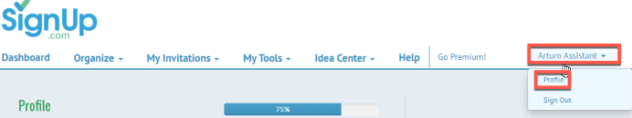
        <li><b>Scroll</b> down to Additional Information</li>
        <li><b>Click</b> the upgrade your account or enter a promo code</li> 
        
        <li><b>Enter</b> the promo code given to you</li>
        <li><b>Click</b> Yes to accept the upgrade</li> 
        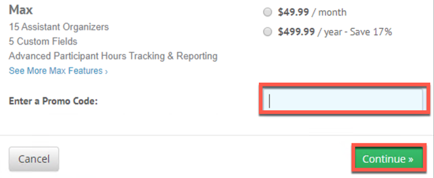
        <li>You are now upgraded to an organizer for the College of Medicine CUP Clinic</li>
    </ol>
    <h2>2. Creating a Sign-up</h2>
    <video width="80%" controls="controls">
    <source
    src="https://arizona.box.com/shared/static/2711m693jgd6naxh7sg64xqeomt6lckd.mp4"
    type="video/mp4">
    </video>
    
As a Program Orgainzer the first step is to set up a sign-up. A sign-up represents an individual event. This event represents an instance of the Shubitz Clinic however, it can represent any event that is scheduled for the CUP Clinic.   To create a sign-up please follow these steps:

    <ol>
        <li>From the dashboard in your account</li>
        <li><b>Click</b> create new signup</li> 
        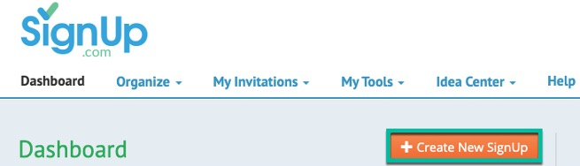
        <li>You will be presented with the details form for a new Signup</li>
        <li><b>Click</b> the dropdown next to the Signup Kind feild</li>
        <li><b>Select</b> Single or Multiple Days</li> 
        
        <li><b>Click</b> the Category dropdown and <b>Select</b> other</li> 
        
        <li><b>Type</b> a name for your signup (Note: you are only given 40 Characters for a name)</li> 
        
        <li><b>Type</b> a message in the Welcome Message field (Note: there is a charachter limit, it is as long as the sample message in the screenshot below)</li> 
        
        <li><b>Type</b> a location for the Location field</li> 
        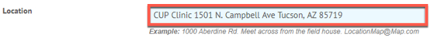
        <li>In the other options area uncheck the following:
        <ul>
            <li>Allow Participants to share their invitations with others</li>
            <li>Allow participants to swap spots</li>
        </ul>
        </li> 
        
        <li><b>Check</b> the Affiliated with a school box</li>
        <li><b>Click</b> the dropdown for the previous schools field and <b>Select</b> the University of Arizona</li>
        <li><b>Uncheck</b> the box next to Email weekly status reports to your teacher</li> 
        
        <li><b>Click</b> the Organizer Information field</li>
        <li><b>Enter</b> the Organizer Title</li>
        <li><b>Enter</b> the Organizer Phone</li> 
        
        <li><b>Click</b> on What Information Do You Want From Participants arrow</li>
        <li>In the Additional Information box type:
        <ul>
        <li>NetID (Note: This is a very important step, <b><u>DO NOT SKIP IT</b></u>. Participants will need to provide their NetIDs to have their hours count)</li>
        <li><b>Check</b> the required box</b></li>
        </ul></li> 
        
        <li><b>Click</b> the arrow next to Limit Spots Per Participants</li>
        <li><b>Check</b> the box in the Limit Spots section</li>
        <li><b>Determine</b> how many spots a particular participant will be allowed to sign up for per Signup (Note: it should at least be one, Otherwise participants can sign up for multiple positions per sign-up.)</li>
        <li><b>Click</b> Next</li> 
        
        
You will now be asked to create spots
 
    </ol>
    
<b>Please note:</b> If you are needing to assign assistant organizers to your event please follow the instructions in Section 3.7 of this guide. <b>THIS IS VERY IMPORTANT: YOU MUST FIRST CREATE THE EVENT AS AN ORGANIZER IN THE COLLEGE OF MEDICINE ORGANIZATION THEN YOU CAN ASSIGN ASSISTANT ORGANIZERS.</b> If the primary organizer is not in the College of Medicine Organization for Signup.com we will not have any record of students signing up for the event and the hours will not be reflected at all.

        <h3>2.1 Create Spots for a Sign-up</h3>
        <video width="80%" controls="controls">
        <source
        src="https://arizona.box.com/shared/static/oslesr16gr7z6c4d6sql7bi8fv132210.mp4"
        type="video/mp4">
        </video>
        
Each signup needs spots to be created. These spots can be thought of as the positions that a student will sign up for. Each Sign-up should have one or more spots to be utilized for the event.   Creating the spots can be done while the Sign-up is created. To create spots follow these steps:

        <ol>
            <li>After creating the Sign-up you will be navigated to a screen with a calendar</li>
            <li>From this calendar you can pick on the day to start creating spots but it is easier to just click on the Create New Spots button</li> 
            
            <li>In the Add a Spot from the first section labled What do you want people to sign up for</li>
            <li><b>Enter</b> the number of spots you would like to create for <b><u>ONE</b></u> spot (Ex. Caregiver will have 4 spots for the Sign-up Shubitz Clinic)</li>
            <li><b>Enter</b> the time for the spot:
            <ul>
            <li><b><u>Important:</b></u> Make sure you enter the total amount of time for this spot as the participant's hours will be a total of these hours (Ex. 5:30PM - 10:30PM = 5Hrs).</li>
            <li>If the spot includes travel time that the participant will get hours for, make sure you account for that time in these time slots</li>
            <li>If the participant will <b><u>not</b></u> be credited for travel time <b>do not</b> add the travel time into this total</li>
            <li><b><u>Rule of Thumb:</b></u> The time counts the hours automatically that the participant will get credit for</li>
            </ul></li>
            <li>At this point, if you have another spot to add, you can add another spot by <b>Clicking</b> on Add Another. However, it is better to add additional spots from the calendar on the previous page</li> 
            
            <li>If you would like to set this spot as a recurring spot leave the radio button on. <b>Select</b> individual days using the calendar checked in the second section</li>
            <li><b>Choose</b> the dates to add this spot to individual days</li> 
            
            <li>If you would like to set this spot as a recurring event <b>click</b> the Set up as a repeating schedule button in the second section</li>
            <li>Set up your recurring schedule</li> 
            
            <li>Add any details about the spot in this third section</li>
            <li><b>Click</b> Save</li> 
            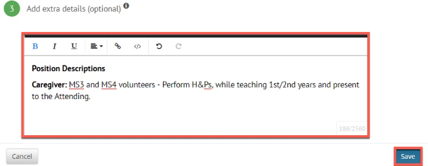
            <li>If you have other spots that need to be set up follow steps 2 - 12 in this section</li>
            <li>When you have set up all of your spots each day should look like the screenshot below with a list of spots for your signup</li> 
            
            
You have complete setting up spots for your signup.
 
        </ol>
        <h3>2.2 Choosing a Theme</h3>
        
This spot is used if you would like to add a these to your signup. By default nothing needs to be done on this page. Just <b>click</b> skip.
 
         
        <h3>2.3 Invite People to your signup</h3>
        
As a CUP Clinic Signup there is no need to "Invite" participants as the calendar will be accessed from MedCats with all signups listed in a group page. <b>PLEASE DO NOT GIVE STUDENTS INDIVIDUAL EVENT LINKS</b>.

        <ul>
        <li><b>Click</b> done to finish creating your signup.</li> 
        
        </ul>
        <h2>3. Managing your Sign-ups</h2>
        
After creating your signup there are a few configurations that you must complete before the Signup is ready to be listed for participants to see and signup for spots. Most of these items are required but some are not. The opttional configurations will be noted.

        <h3>3.1 Email Preferences (Mandatory)</h3>
        <video width="80%" controls="controls">
        <source
        src="https://arizona.box.com/shared/static/2mwl1y8ujcn5gk19o1k4by8pxbsbx2v0.mp4"
        type="video/mp4">
        </video>
        
As an organizer you are able to set email preferences such as the ability to send automatic messages to participants who signed up for a spot a couple days prior to the event to remind them of their sign-up. You can also notify participants when spots have changes, to adding extra details to reminders. To edit/set your email preferences please follow these steps:

        <ol>
            <li><b>From</b> the Dashboard</li>
            <li><b>Find</b> your Sign-up (Ex. 2020-02 Shubitz Clinic)</li>
            <li><b>Click</b> on the name of your Signup to open the event</li> 
            
            <li><b>Click</b> the settings tab</li> 
            
            <li><b>Select</b> Email Preferences</li>
            <li><b>On this page</b> you will be able to modify email settings</li>
            <li><b>Set</b> the email settings to your needs
            <ul>
                <li><b>Note:</b> You need to set the selection to ALWAYS for the Notify Me when Someone signs up</li></ul>
            <li><b>Click</b> Save at the bottom of the form to save your changes</li> 
            
            </ol>
            <h3>3.2 Premium Locking (Mandatory)</h3>
            <video width="80%" controls="controls">
            <source
            src="https://arizona.box.com/shared/static/ax8rfm6ypbam36m0n7eg96jgg9qctuf1.mp4"
            type="video/mp4">
            </video>
        
As an organizer you have the ability to lock down your Sign-up. You can tell theprogram when you want the Sign-up to open and allow participants to sign up for spots. You can also decide when the Sign-up will close and send email reminders notifying participants of when these dates will take place a few days prior to the dates taking effect. For the CUP Clinic Spots you must set the Sign-up to Lock 1 week prior to the activity date. The reminder must be set to send 2 days prior to the event locking date. (Ex: Signup takes place on March 10th 2020, Set locking date to March 3rd 2020, Send reminder on March 1st 2020.) To set premium locking features please follow these steps:

        <ol>
            <li><b>From</b> the Dashboard</li>
            <li><b>Find</b> your Sign-up (Ex. 2020-02 Shubitz Clinic)</li>
            <li><b>Click</b> on the name of your Signup to open the event</li> 
            
            <li><b>Click</b> the settings tab and <b>Select</b> Premium Locking</li> 
            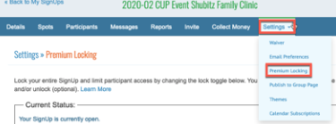
            <li>You can <b>Toggle</b> the switch to Open/Close the event</li>
            <li>If you prefer to set the Sign-up to open on a specific date</li>
            <li><b>Check</b> the Open Date box</li>
            <li><b>Set</b> a date and time</li>
            <li>If you prefer to set a close date for your Sign-Up</li>
            <li><b>Check</b> the Close Date Box</li>
            <li><b>Set</b> a date and time</li>
            <li><b><u>BE Aware:</b></u> that by checking this Box <b>ALL</b> spots will close on this date for this specific Sign-Up this is All or nothing. This option would be great for events that occur on one date once a month.</li>
            <li><b>Weekly</b> Sign-ups or multiple spot dates per month follow the section on Duplicating Signups.</li></ul> 
            
            <li>If you want to set an Opening Reminder
            <ul>
            <li>Open Date Check Box needs to be enabled for this section to be editable</li>
            </ul>
            <li><b>Check</b> the Opening Reminder box</li>
            <li><b>Set</b> a send date</li>
            <li><b>Write</b> your message</li> 
            
            <li>If you want to set a Closing Reminder
            <ul>
            <li>Close Date Check Box needs to be enabled for this section to be editable</li>
            </ul>
            <li><b>Check</b> the Closing Reminder box</li>
            <li><b>Set</b> a send date</li>
            <li><b>Write</b> your message</li>
            <li><b>Click</b> Save to set the preference</li> 
            
        </ol>
            <h3>3.3 Publish to Group (Mandatory)</h3>
            <video width="80%" controls="controls">
            <source
            src="https://arizona.box.com/shared/static/orvit30p5snydu4ia6u4o2cqudnousbf.mp4"
            type="video/mp4">
            </video>
            
<b>Publishing to the MedCats Group is mandatory</b> as all Sign-ups must be present on the group page for all participants to sign-up to. To Publish the Sign-up to the group page follow these steps:

            <ol>
                <li><b>From</b> the Dashboard</li>
                <li><b>Find</b> your Sign-up (Ex. 2020-02 Shubitz Clinic)</li>
                <li><b>Click</b> on the name of your Signup to open the event</li> 
                
                <li><b>Click</b> the settings tab and <b>Select</b> Publish to Group Page</li>
                <li><b>Click</b> the Group Page dropdown menu</li>
                <li><b>Select</b> MedCats CUP Events (CUP Administrators)</li> 
                
                <li><b>Click</b> OK</li> 
                
            </ol>
            
<b>NOTE:</b> This is the approved way to share the invitation for the event. This sight will show all events for every CUP Clinic that students can sign up for. Give students the link to this site to sign up for the event <a href="https://signup.com/Group/407029700153678030/" target="_blank">College of Medicine CUP Events</a>. There is no need to give students direct invites to specific events.

            <h3>3.4 Check-in (Mandatory)</h3>
            <video width="80%" controls="controls">
            <source
            src="https://arizona.box.com/shared/static/vvb3jkww716uoh1eblu2zwsey7m53pim.mp4"
            type="video/mp4">
            </video>
            
Signup.com allows Organizers to check in participants. To Check in participants for your Signup Event

            <ol>
                <li><b>Hover</b> your mouse over My Tools in the menu</li>
                <li><b>Select</b> Participant Check-in</li> 
                
                <li><b>Click</b> Continue</li>
                <li><b>Click</b> Next on the next screen</li> 
                
                <li><b>Select</b> the signup that will need to be checked in</li>
                <li><b>Click</b> Next</li> 
                
                <li><b>Click</b> Next leaving the options unchecked on the next screen</li> 
                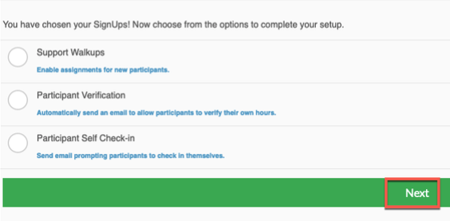
                <li><b>Click</b> Get Started</li>
                <li><b>Click</b> the participants name</li>
                <li><b>Check</b> them in</li>
                <li><b>Click</b> Done</li> 
                
                <li><b>Repeat</b> for each participant.</li>
                
<b>Important Note</b> It is very important that you checkin the participants <b>DURING</b> the event. If the participant is not checked into the event they will be assumed to have missed the event and will not get credit for it. If you miss the checkin Organizers <b>MUST</b> check these participants in within 24hrs of the event. If not you will need to contact Hildi Williams to fix the issue.

            </ol>
            <h3>3.5 Commenting Changes for Special Circumstances (Mandatory - Only if special circumstances need to be considered)</h3>
            
Each registrant for a signup has the ability to comment in any issues that may arise from a particular event. If anything changes that the Organizer needs to comment they can do so within the signup itself so the person who is providing the reports for hours can make any adjustments as needed.

            
To comment a signup please complete the following:

            <ol>
                <li><b>Log into</b> Signup.com</li>
                <li>On the Dashboard <b>select</b> the event that needs to be commented</li> 
                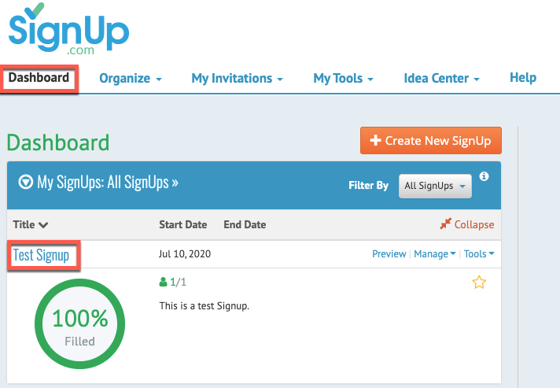
                <li><b>Click</b> the Participants Tab</li>
                <li><b>Click</b> the Participant that needs to be commented on</li> 
                
                <li><b>Click</b> the comment icon for the appropriate spot that the participant needs to have commented</li> 
                
                <li><b>Add</b> the comment that needs to be notated in the Comments Box</li>
                <li><b>Click</b> add</li> 
                
                <li><b>Notice</b> the comment has been added</li>
                <li><b>Click</b> the X at the top right corner of the comment box</li> 
                
                <li><b>Click</b> Save in the Participant Details box</li> 
                
                <li>The participant has been commented</li>
                </ol>
                
You can use this field in the event that you need to explain anything that needs to be communicated with the person who will be responsible for pulling the correct report for student hours.
                

            <h3>3.7 Transferring Events to Cup Administrators <b>(Mandatory)</b></h3>
            
As Leaders for the Cup Clinic your term is one(1) year. During this term your account for Signup.com needs to be upgraded to an organizer account. However, the events that you create with your account will be tied to your individual account so when it comes time to demote your account to an individual account your events will stay with your account and the data will not be available for the CUP Administrators. To fix this issue you will need to transfer your events to the CUP Administrators prior to your account being demoted. We require that this process be completed at least <b><u>TWICE</b></u> during your term. Once at six months and the other just before your account is demoted. There are two parts to this process; 1) Edit positions within your events to include your name, and 2) transfer the event.

            
To edit your positions please complete the following process: <b>NOTE:</b> you will need to complete this for <b>EACH</b> position in <b>EACH</b> event that you created in Signup.com.

            <ol>
              <li><b>Log into</b> Signup.com</li>
              <li><b>Click</b> the event you want to transfer</li> 
              
              <li><b>Click</b> List View to view a list of all event dates</li>
              <li><b>Filter</b> list by all Spots</li>
              <li><b>Expand</b> each date to view positions</li>
              <li><b>Click</b> edit to edit the position</li> 
              
              <li><b>Scroll</b> to the bottom of the page</li>
              <li><b>Enter</b> your name in the extra details field. <b>NOTE:</b> Please do not delete your original position description. Just enter your name so we know you created the event.</li> 
              
              <li><b>Click</b> Save. If you are asked to save multiple or just this one position save all of them.</li>
              <li><b>Repeat steps 5 - 9 for <u>EVERY</u> position under <u>EVERY</u> date for your event for <u>EVERY</u> event you created.</b></li>
            </ol>
            
To transfer events to the CUP Administrator please follow these steps:

            <ol>
              <li><b>Log into</b> Signup.com</li>
              <li>On your dashboard <b>click</b> "My Signups" to display other options</li> 
              
              <li>You can either select individual events or all events by <b>checking</b> the box next to the event or in the header</li>
              <li><b>Click</b> the transfer button</li> 
              
              <li><b>Enter</b> the following email address into the New Organizer Email field <b>com-tcup@medadmin.arizona.edu</b>.</li>
              <li><b>Click</b> Enter to transfer the events. The events will be transferred to the Cup Administrators and you will no longer see them in your list.</li> 
              
            </ol>
            <h3>3.8 Duplicating signups (Optional)</h3>
            
Duplicating signups allows the entire signup to be duplicated, this includes duplicating the spots and most settings within the original signup. The oprion is perfect for enforcing locking rules for recurring spots that occur once a month. To duplicate a signup:

            <ol>
                <li><b>Click</b> the Dashboard</li>
                <li><b>Locate</b> the signup that you want to duplicate in the My Signups area</li>
                <li><b>Click</b> the Tools menu</li>
                <li><b>Select</b> Duplicate</li> 
                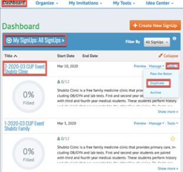
                <li><b>Type</b> a New Name for your signup</li>
                <li><b>Click</b> Move Spots to New Start Date</li>
                <li><b>Select</b> the date you want the spots to start</li>
                <li><b>Click</b> Duplicate</li> 
                
                <li><b>Click</b> the spot to double check all information is copied over</li> 
                
                <li><b>Enable</b> the Locking Features in Section 3.4</li>
                <li><b>Publish</b> the new posting to the Medcats Group page as in Section 3.5</li> 
                
                <li><b>Click</b> details</li>
                <li><b>Affiliate</b> the spot with the University of Arizona</li>
                <li><b>Uncheck</b> the Email weekly status reports to your teacher</li>
                <li><b>Ensure</b> the Assistant Organizers are assigned, If needed</li>
                <li><b>Ensure</b> the NetID is added as an additonal field</li>
                <li><b>Ensure</b> Limit Spots to 1 spot per signup is enabled</li>
                <li><b>Click</b> update</li> 
                
            </ol>
            <h3>3.9 Assistant Organizers (Optional)</h3>
            <video width="80%" controls="controls">
            <source
            src="https://arizona.box.com/shared/static/q5ghh8ba9bvmh1jc19k2mcpu8qdoyvfn.mp4"
            type="video/mp4">
            </video>
            
Assistant Organizers are individuals that you can assign privilages to so they will be able to manage and edit a signup that you created. Signup.com allows each signup the ability to have up to 15 Assistant Organizers. This section will explain the process on how to assign Assistant Organizers. A seperate user guide will be created for Assistant Organizers. To assign an Assistant Organizer to your signup follow these steps:

            <ol>
                <li><b>From</b> the Dashboard</li>
                <li><b>Find</b> your Sign-Up (Ex. 2020-02 Shubitz Clinic)</li>
                <li><b>Click</b> the name of your signup to open the event</li> 
                
                <li><b>Click</b> the Details Tab</li> 
                
                <li><b>Scroll</b> to the Organizer Information section of the Details Form</li>
                <li><b>Enter</b> the Assistant Organizer’s Email Address (<u>Netid@email.arizona.edu</u>)</li>
                <li>The name will auto populate</li>
                <li><b>Enter</b> the Phone Number and Title</li>
                <li>To add more assistants <b>click</b> the Add an Assistant Organizer button</li>
                <li><b>Repeat</b> steps 6 – 8</li> 
                
            </ol>
            <h3>3.10 View Participants</h3>
            <video width="80%" controls="controls">
            <source
            src="https://arizona.box.com/shared/static/treua6tic78ta4nhknkpy40uh7xgiksu.mp4"
            type="video/mp4">
            </video>
            
To view all participants no matter what spot they signed up for:

            <ol>
            <li><b>Click</b> Participants in the menu</li> 
            
            <li>A list of participants will populate with the status of their invitations/signups</li>
            </ol>
            <h3>3.11 View Participants Per Spot</h3>
            <video width="80%" controls="controls">
            <source
            src="https://arizona.box.com/shared/static/gl0hnuxobxp9gz7g12dvx1a7r1bbbkvp.mp4"
            type="video/mp4">
            </video>
            
To view individual participants in a single spot

            <ol>
            <li><b>Click</b> Spot in the menu</li>
            <li><b>Click</b> List View next to spots to view each spot in a list</li>
            <li><b>Notice</b> each spot is listed with the participant who is assigned to the spot</li> 
            
            </ol>
            <h3>3.12 Manage Participants in Each Spot</h3>
            <video width="80%" controls="controls">
            <source
            src="https://arizona.box.com/shared/static/km2s2v5a2n4cooftzofw7f9dwj943ded.mp4"
            type="video/mp4">
            </video>
            
Signup.com gives you the ability to manage participants in each spot. For example, you can edit a participant for a spot such as delete them or assign an individual to a spot. To Delete an individual from a spot:

            <ol>
            <li><b>Click</b> Spot in the Menu</li>
            <li><b>Click</b> List view next to Spots to view each spot for a signup</li>
            <li><b>Click</b> Assign next to the individual spot</li> 
            
            <li><b>Click</b> the X to delete the individual participant</li> 
            
            <li><b>Click</b> Delete Only This Assignment or Delete all Future Assignments (This depends on you) to delete the participant</li> 
            
            </ol>
            
To add an individual to a spot:
                
            <li><b>Click</b> Spot in the Menu</li>
            <li><b>Click</b> List view next to Spots to view each spot for a signup</li>
            <li><b>Click</b> Assign next to the individual spot</li> 
            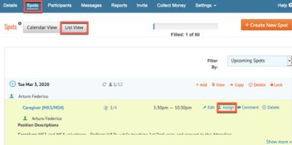
            <li><b>Enter</b> the User’s email address and select their account from the dropdown (Ex. NetID@email.arizona.edu)</li> 
            
            <li>They will be assigned to the spot and an email invitation will be sent to them</li> 
            
            </ol>
            <h3>3.13 Messaging (Optional)</h3>
             <video width="80%" controls="controls">
              <source
              src="https://arizona.box.com/shared/static/7ij7uyq2n8oso1rm7qcp3d6lrzso1yka.mp4"
              type="video/mp4">
              </video>
            
Signup.com allows Organizers to send customized emails to all participants who have signed up for spots within the Signup. To Send messages to all participants:

            <ol>
            <li><b>Click</b> the Messages item in the menu</li>
            <li><b>Click</b> Select Email Participants</li> 
            
            <li>You have the option to send to individual participants or by a specific group
            <ul>
            <li><b>Click</b> the tick marks next to the Participants Name</li>
            <li><b>Filter</b> by Status, Date Scheduled or Spot</li>
            <li><b>Select</b> the results in the please select one field</li>
            </ul>
            <li>If you want to send to all participants</li>
            <li><b>Click</b> Add All</li>
            <li><b>Click</b> Save List</li> 
            
            <li><b>Enter</b> a subject in the subject line or leave it the same</li>
            <li><b>Enter</b> you message in the message field</li>
            <li><b>Click</b> Send to send</li> 
            
            </ol>
            <h3>3.14 Reporting (Optional)</h3>
            <video width="80%" controls="controls">
            <source
            src="https://arizona.box.com/shared/static/bnt4zlapt1opv8rwvwgc395bv3nneh47.mp4"
            type="video/mp4">
            </video>
            
Signup.com allows Organizers to gather reports. Assistant Organizers can access these reports from a Signup Level only. To Generate reports for a Signup:

            <ol>
            <li><b>Click</b> Reports in the Menu</li> 
            
            <li><b>Select</b> a report to generate.</li>
            </ol>
            <h3>3.15 Adding Participants to an event if the event has already passed</h3>
            
Adding participants after an event is not a very good practice as all participants should have signed up for the event and the record will be created in Signup.com so hours can be given to the person who participated. However, we realize mistakes happen and as such Organizers can add participants to an event after it has taken place.   There is a limited timelimit to complete these steps. Reports are pulled at the beginning of the month for the month prior. Example: Events for May are pulled in June. If a participant is added at the beginning of the month after an event happened the person will still not get credit as the report for that month has already been pulled. However, if the person is not registered for an event and that registration is added during the same month they will be counted as the report will pull the added person.  If you miss this time window you will have to contact Hildi Williams to correct the issue. <b>Easy way to handle this is to not let it happen in the first place!</b>   To add a person to an event that has already happened please follow these steps:

            <ol>
            <li><b>Log Into</b> Signup.com</li>
            <li><b>Click</b> on your dashboard tab</li>
            <li><b>Click</b> on the event that you need to add the person to</li> 
            
            <li><b>Click</b> the Spots tab</li>
            <li><b>Click</b> the List View for the spots</li>
            <li><b>Find</b> the event date in the list and expand it.</li>
            <li><b>Click</b> assign</li> 
            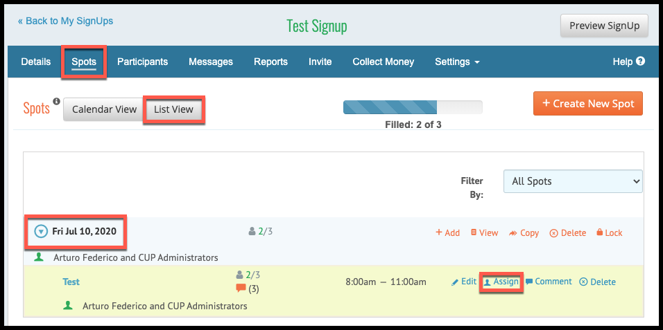
            <li><b>Click</b> the Assign this spot field</li>
            <li><b>Select</b> Add new Participant</li> 
            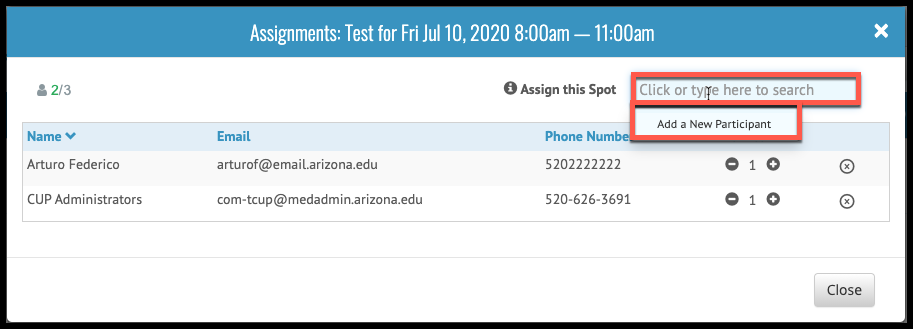
            <li>The form will populate</li>
            <li><b>Enter</b> the Name</li>
            <li><b>Enter</b> the Email</li>
            <li><b>Enter</b> the NetID - <b>This is important Enter the netID, if you don’t know it you can get it from the email address as the email is netid@email.arizona.edu</b></li>
            <li><b>Click</b> done</li>
            <li>They will be added to the event</li> 
            
            <li><b>Click</b> Comment in the event</li>
            <li><b>Enter</b> a comment</li>
            <li><b>Click</b> Add</li> 
            
            <li>The process is complete</li>
</body>
</html>
