### Signup.com Student Guide

## 1. Registering for a Sign-up.com account
<video width="80%" controls="controls">
<source src="https://arizona.box.com/shared/static/omkxxdt61xaw8z23aps6dwnvjzenr5ps.mp4" type="video/mp4">
</video>

In order to signup for CUP Clinic events you must register for a Sign-up.com account. To register for an account

1. <b>Open</b> a browser</li>
2. <b>Navigate</b> to <a href="https://www.signup.com" target="_blank">https://www.signup.com</a>
3. <b>Click</b> Register in the top right corner of the screen

4. <b>Enter</b> your required information

    1. Firstname
    2. Lastname
    3. Email: <b><u>Important: You need to use your official University of Arizona Email address netid@email.arizona.edu. If you do not you will not get credit for CUP hours worked.</b></u>
6. Verify the Captcha image
7. Click Continue

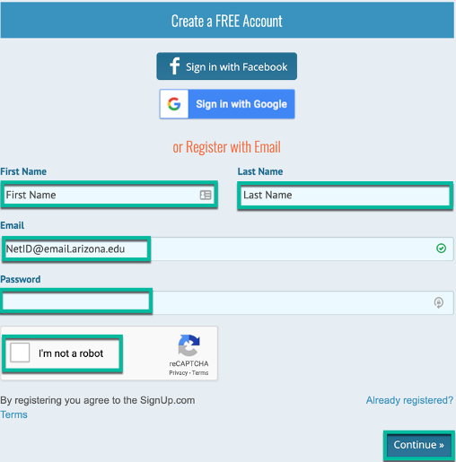

You have successfully registered your account with Signup.com

## 2. Signing up for CUP Clinic Spots

When CUP Clinic sign-ups are available you will access the events by clicking on a link in MedCats. The Link will navigate you to signup.com with a list of all available spots for the CUP clinic.

To register a spot:

1. <b>Click</b> the link to be navigated to Sign-up.com
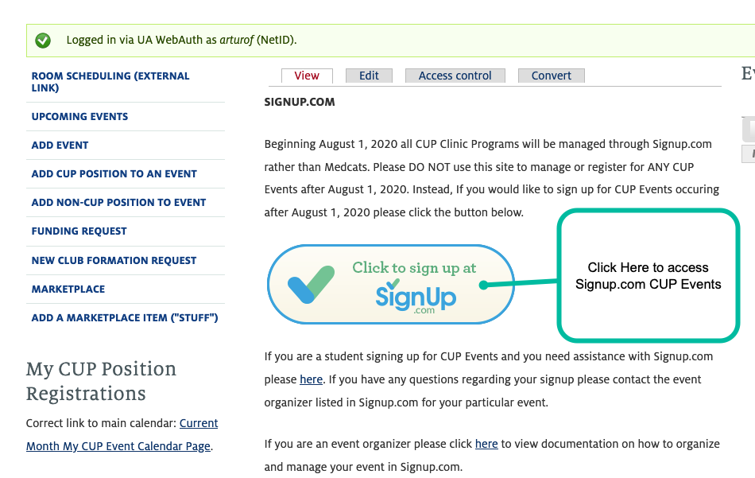
2. You will find all Sign-ups available for the CUP Clinic
3. <b>Click</b> View next to each Sign-up to view available spots
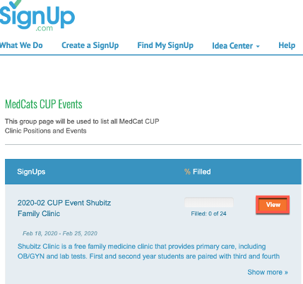
4. Once you find a spot to sign up for <b>Click</b> the Green Sign Up button
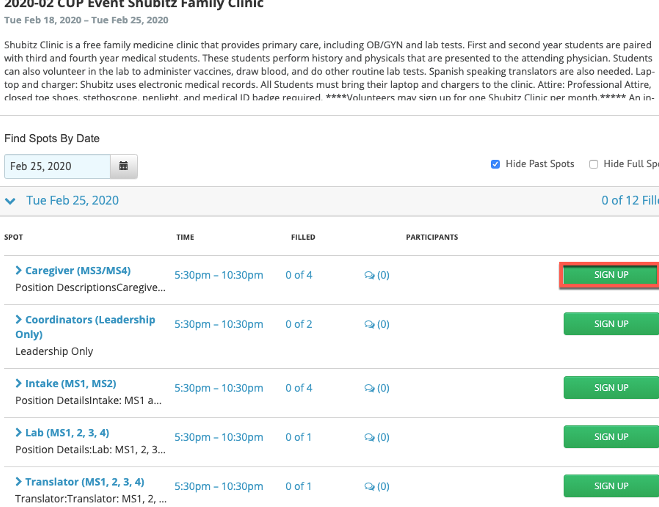
5. <b>Sign in</b> with your NetID@email.arizona.edu and <b>Click</b> Continue

6. <b>Confirm</b> your email
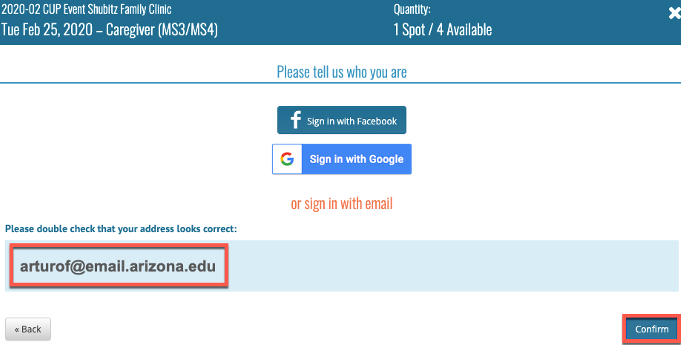
7. <b>Enter</b> your Phone number
8. <b>Decide</b> if you want SMS reminders (Text Messages)
9. <b>Enter</b> your NetID <b><u>NOTE:</b></u> you must enter your <b><u>CORRECT</b></u> NetID here. You will not receive credit if your NetID is incorrect.
10. <b>Click</b> Save and Done
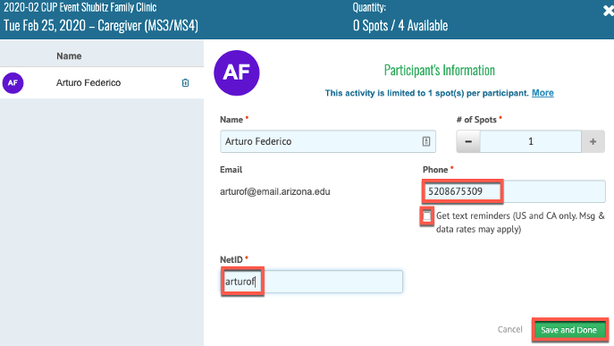

## 3. Remove your registration

Up until one week <b><u>PRIOR</b></u> to the Sign-Up you will be able to remove your registration and allow others to sign-up for your spot.

To remove your registration:

1. <b>Navigate</b> to Sign-up.com
2. <b>Sign-in</b> using your username and password
3. <b>Scroll</b> to the My Invitations section of your Dashboard
4. <b>Click</b> the name of the Sign-up
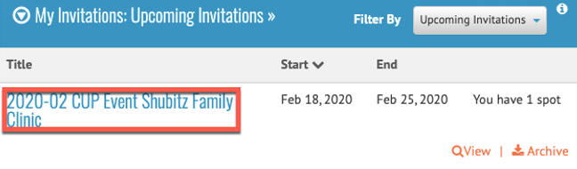
5. <b>Click</b> the Blue My Spots button
6. <b>Select</b> Remove
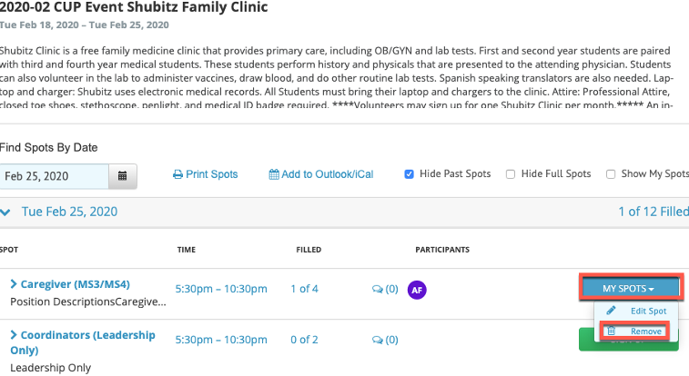
7. <b>Confirm</b> your removal
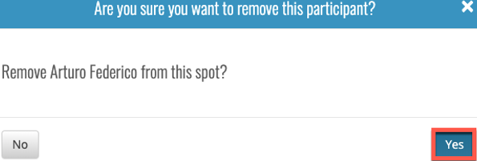

## 4. Find the organizer for your event

If there is any questions regarding the event that you signed up for or if you need to contact the organizer for any reason please follow these instructions on how to get the information for your organizer:

1. <b>Log into</b> Signup.com
2. <b>Scroll</b> down and <b>select</b> the event you signed up for in the My Invitations section
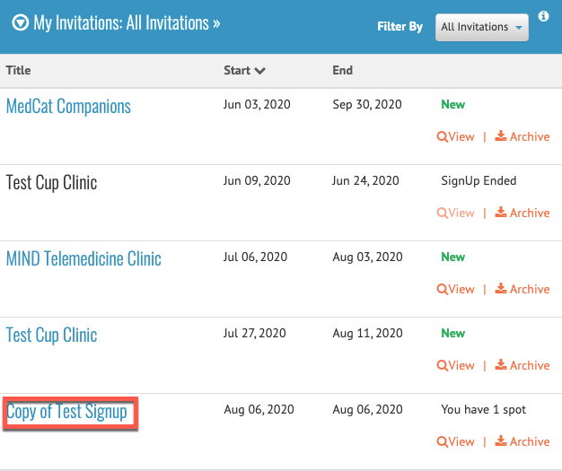
3. <b>Click</b> the index card in the left hand menu
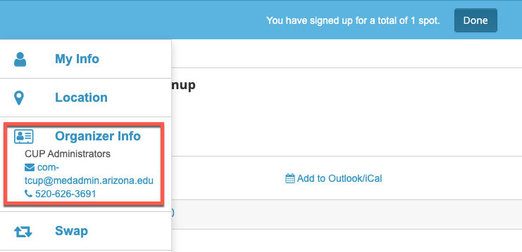
4. The organizer's contact information will be listed

## 5. View Monthly CUP Hours utilizing MedReports

Starting immediately CUP Student hours will be able to view their individual CUP Hours for events they volunteered in. This service is provided by the College of Medicine - Tucson reporting system called MedReports. To access MedReports please complete the following:

1. <b>Navigate</b> to <a href="https://medreports.medicine.arizona.edu" target="_blank">https://medreports.medicine.arizona.edu.</a>
2. <b>Click</b> Login using NetID and Password
3. <b>Login</b> with your NetID and Password 

4. On login you will only have access to the CUP Hours by Student's V2 report
5. <b>Click</b> the report logo to access the report 
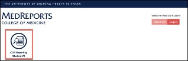
6. Once in the report. <b>Click</b> View Report in the upper left corner
7. You will see a list of all the events you have volunteered for with the associated hours for that event.
8. The hours are filtered by date from oldest to newest. To filter dates from newest to oldest
9. <b>Click</b> the Sort icon in the date column

<b>Note:</b> The system will always be one month behind in reporting hours as all hours are marked as of the end of the last month. Ex. In August 2020 the report will be current as of July 2020, Etc. Any questions regarding your hours please contact your event leader in the Organizer Name Column.