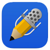

# MedLearn and Notability

Here is an overview of how to download files from MedLearn and annotate them in Notability.

1. In MedLearn, select the event you want to download resources from either from the Dashboard Calendar or from the Learning Events table.

2. Click on the Event Resource that you want to annotate.

3. The file should open in a new tab on your iPad.

4. Once the file is loaded in the new tab tap on the screen and then click on "More..."

## Option A: Notability w/ Box Connection (Recommended)

5a. In the "More..." menu select Box.

6a. Login to Box if you aren't already.

7a. Then once Box opens select the destination folder, then click upload.

8a. Now open Notability.

9a. Add Box as an Account if it isn't already.

10a. Click the download/import icon in Notability and select Box.

11a. Go to the folder you saved the MedLearn file to, and click on the file to open it in Notability.

12a. You can either create a new note with this file or add to another note, then click Import and Open.

## Option B: Notability w/ Local Files

5b. In the "More..." menu select Import with Notability.

6b. The MedLearn file will open Notability, select to create a new note or add to other note.

7b. Then click import, then you can open the file.
