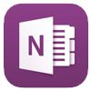

# MedLearn and OneNote

Here is an overview of how to download files from MedLearn and annotate them in OneNote.

1. In MedLearn, select the event you want to download resources from either from the Dashboard Calendar or from the Learning Events table.

2. Click on the Event Resource that you want to annotate.

3. The file should open in a new tab on your iPad.

4. Once the file is loaded in the new tab tap on the screen and then click on "More..."

5. In the "More..." menu select Import with OneNote.

6. Sign in to OneNote if you aren't already.

7. Select the Notebook you want the file to import into.

8. Select the Section of the Notebook you want the file to import into.

9. Choose to insert the file as either an Attachment or Printout.
