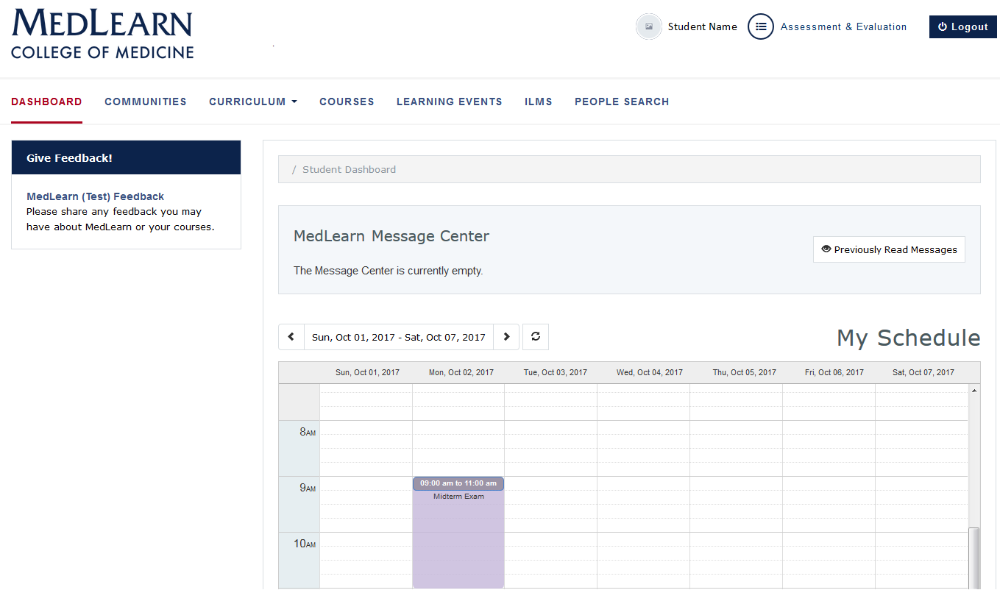
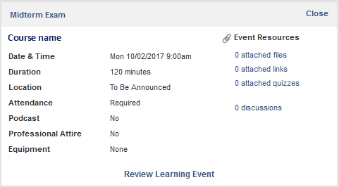

# Dashboard
The dashboard is displayed by default when logging in to MedLearn.  If you navigate away from the dashboard, simply click on the MedLearn logo or the **Dashboard** link to return to it.

**Please NOTE:** MedLearn will only show learning events and course-related items that are specific to the pilot course.  Continue to use ArizonaMed for functions related to other courses.

## Notices
Faculty and staff are able to post messages for student information.  Once posted, messages are shown on the dashboard.

* Unread messages are shown in the **MedLearn Message Center**
* Check the box next to the message date
* Click the **Mark as Read** button to hide messages
* Click the **Previously Read Messages**
  * Messages you have already read are shown in the grid
  * Click on a message to view it

## Calendar (View Learning Events and Resources)
Learning events for each of the courses are displayed on the student calendar.  Event details (e.g. location, duration, attendance requirements, etc.) and resources are accessed by clicking on the event.  

* The calendar defaults to the current week
* Refer to the date range field
* Use the arrows to select past and future dates
* Click on the event to review event details
  * Pay special attention to the texts in the **Attendance** and **Professional Attire** fields
* Click on the **Event Resources** link to access learning materials

  

## Submit Course Feedback
Students are able to submit feedback for specified courses directly from their dashboard.

* Refer to the **Give Feedback!** section in the left menu
* Click the **MedLearn Feedback** link
* The feedback form will be displayed
* Indicate you are **providing course feedback**
* Add your **Feedback or Comments**
* Press the **Submit** button to save and submit your feedback
