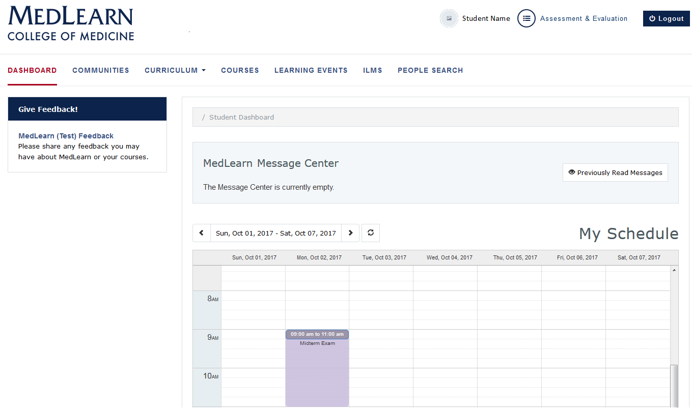

# MedLearn Student Pilot Guide
Thank you for participating in the MedLearn pilot.  We have created an icon on the MedPortal to help you access everything you need for the pilot.  Simply click on the icon “Fall 2017 Nervous System MedLearn Pilot”.  You will find icons to help you navigate to your profile, schedule, courses, assignments, ILMs, gradebook, surveys, absence request and important messages.  As well as a link to help you return to ArizonaMed.  The project team encourages you to submit course and system feedback through the portal (icon included).

### 1  Dashboard
The dashboard is displayed by default when logging in to MedLearn.  If you navigate away from the dashboard, simply click on the MedLearn logo or the **Dashboard** link to return to it.

**Please NOTE:**  Dashboard and Assessment & Evaluation functions in MedLearn will only show learning events and course-related functions that are specific to the pilot course.  Continue to use ArizonaMed for functions related to other courses.

#### 1.1 Notices
Faculty and staff are able to post messages for student information.  Once posted, messages are shown on the dashboard.

* Unread messages are shown in the **MedLearn Message Center**
* Check the box next to the message date
* Click the **Mark as Read** button to hide messages
* Click the **Previously Read Messages**
  * Messages you have already read are shown in the grid
  * Click on a message to view it

#### 1.2 Calendar (View Learning Events and Resources)
Learning events for each of the courses are displayed on the student calendar.  Event details (e.g. location, duration, attendance requirements, etc.) and resources are accessed by clicking on the event.  

* The calendar defaults to the current week
* Refer to the date range field
* Use the arrows to select past and future dates
* Click on the event to review event details
  * Pay special attention to the texts in the **Attendance** and **Professional Attire** fields
* Click on the **Event Resources** link to access learning materials

  

#### 1.3 View Enrolled Courses
* Click the **Courses** tab
* A list of the courses you are enrolled in is displayed Clicking on a course will direct you to the course details page for the selected course
  * Courses that span the length of your medical school career are listed first, in the **Longitudinal Courses** section
  * **Preclinical Blocks** and **Clinical Blocks** are listed next

##### _1.3.1 Access Course Details and Resources_
* Refer to the **Course Quick Select** field in the upper right corner
* Select a course from the dropdown
* **Course details** are displayed on the screen
* Scroll down or select the **Course Resources** link from the left menu to find Course Resources

##### _1.3.2 Contact Course Staff_
* Course directors, coordinators and faculty are listed in the **Course Details** section.  Simply click their names to create an email.

#### 1.4 Submit Course Feedback
Students are able to submit feedback for specified courses directly from their dashboard.

* Refer to the **Give Feedback!** section in the left menu
* Click the **MedLearn Feedback** link
* The feedback form will be displayed
* Indicate you are **providing course feedback**
* Add your **Feedback or Comments**
* Press the **Submit** button to save and submit your feedback

### 2  Student Profile
Individual student-related information is maintained in the student profile.

* Refer to the top, right portion of the screen
* Click your name to be directed to your profile
* Refer to the left menu to access
  * Gradebooks
  * Assignments
  * Absence Requests

#### 2.1 View Grades

* Click the **My Gradebooks** link in the left menu
* A list of courses and corresponding grades is displayed
* Click the **MK** and/or **PC** links to see a breakdown of the Medical Knowledge and Patient Care
  * Each assessment will be listed with the individual assessments, their “weight”, your score, and contribution toward final grade
  * Grade adjustments (if applicable) are displayed
  * Final course grade is displayed

#### 2.2 Submit Assignments
* Click the **My Assignments** link in the left menu
* Click the **+ Add File** button to upload your completed assignment
* Click the **+ Add Assignment Comment** button to add relevant comments

#### 2.2 Submit an Absence Request
The Attendance Policy is located on the COM-T website at http://medicine.arizona.edu/students/student-policies-forms. Please familiarize yourself with the policy before submitting requests for personal passes.   
* Select **My Absence Requests** from the left menu
* Any previously-requested absences will be displayed
* Press the **Add Absence Request**
* The **Adding an Absence Request** screen will be displayed
* Add the **Start Date** and **End Date**
* Indicate each event that is included in the absence request

**NOTE:**  If the events all fall on a single day they will be counted as only one pass request, however if you request only one required event on a day it will count as one pass but you will still be required to attend the other events on that day.

* Select an **Absence Type**
* Add a **Comment** if applicable
* The **Comment** field becomes available based on the **Absence Type**
* Press the **Save** button to save the request (**Cancel** button to cancel the request)
* The saved request will show “Pending” in the **Status** column
* You will receive an email notice when the course director/coordinator approves or denies the request and an email from Student Affairs when they have approved or denied the request.

### 3  Submit Assessments and Evaluations

* Refer to the top, right portion of the screen
* Click the **Assessment & Evaluation** link to be directed to student assessments
* Click the corresponding tab to view
  * **Assessment Tasks**
  * **Tasks Completed on Me**
  * **My Completed Tasks**
